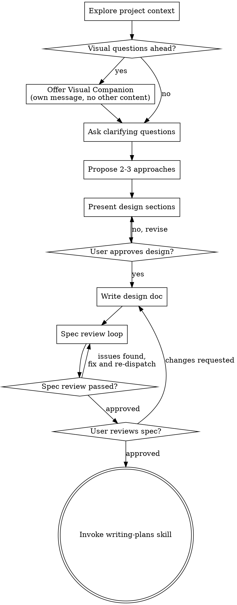

<!-- Generated by SpecStory, Markdown v2.1.0 -->

# 2026-03-20 15:31:28Z

<!-- Claude Code Session 2ebc0ea2-e9e3-41f0-8473-1a884ef55483 (2026-03-20 15:31:28Z) -->

_**User (2026-03-20 15:31:28Z)**_

https://github.com/wierdbytes/dotfiles/tree/master/home/dot_claude слушай, посмотри вот этот статуслайн, посмотри, как там работает отображение гита (комиты и прочее)

---

_**Agent (claude-opus-4-6 2026-03-20 15:31:34Z)**_

_**Agent (claude-opus-4-6 2026-03-20 15:31:35Z)**_

<tool-use data-tool-type="unknown" data-tool-name="ToolSearch"><details>
<summary>Tool use: **ToolSearch**</summary>

**Input:**

- max_results: `3`
- query: `select:Skill,WebFetch,Read`

**Result:**

```

```
</details></tool-use>

_**Agent (claude-opus-4-6 2026-03-20 15:31:38Z)**_

_**Agent (claude-opus-4-6 2026-03-20 15:31:43Z)**_

<tool-use data-tool-type="read" data-tool-name="WebFetch"><details>
<summary>Tool use: **WebFetch**</summary>
 `https://github.com/wierdbytes/dotfiles/tree/master/home/dot_claude`

```text
# File Tree Structure for `dotfiles/home/dot_claude`

Based on the GitHub repository content, here's the directory structure:

```
dotfiles/
└── home/
    └── dot_claude/
        ├── executable_statusline-command.sh
        └── private_settings.json
```

## Directory Contents

The `dot_claude` folder contains **2 files**:

1. **executable_statusline-command.sh** - A shell script file (executable)
2. **private_settings.json** - A JSON configuration file

This appears to be a dotfiles repository managed with Chezmoi, where the `dot_claude` directory likely contains configuration files for Claude, organized under the home directory structure where dotfiles are prefixed with `dot_` to represent hidden configuration folders in the user's home directory.
```
</details></tool-use>

_**Agent (claude-opus-4-6 2026-03-20 15:32:02Z)**_

<tool-use data-tool-type="read" data-tool-name="WebFetch"><details>
<summary>Tool use: **WebFetch**</summary>
 `https://github.com/wierdbytes/dotfiles/blob/master/home/dot_claude/executable_statusline-command.sh`

```text
# Complete Raw Content of executable_statusline-command.sh

```bash
#!/bin/bash

# Tokyo Night Storm palette
C_RED="\033[38;2;247;118;142m"
C_YELLOW="\033[38;2;224;175;104m"
C_GREEN="\033[38;2;158;206;106m"
C_CYAN="\033[38;2;125;207;255m"
C_BLUE="\033[38;2;122;162;247m"
C_PURPLE="\033[38;2;187;154;247m"
C_GRAY="\033[38;2;86;95;137m"
C_RESET="\033[0m"

# Read JSON input from stdin
input=$(cat)

# Extract current directory
current_dir=$(echo "$input" | jq -r '.workspace.current_dir')

# Git information
git_branch=""
git_status=""
if git -C "$current_dir" rev-parse --git-dir > /dev/null 2>&1; then
 git_branch=$(git -C "$current_dir" --no-optional-locks branch --show-current 2>/dev/null)
 if [ -n "$git_branch" ]; then
  if git -C "$current_dir" --no-optional-locks diff-index --quiet HEAD 2>/dev/null; then
   git_status="✓"
  else
   git_status="✗"
  fi
 fi
fi

# Shorten directory path and split for coloring
short_dir=$(echo "$current_dir" | awk -F'/' '{n = NF; if (n <= 3) print $0; else printf "…/%s/%s/%s", $(n-2), $(n-1), $n}')
# Split into parent path (gray) and current dir (purple)
dir_parent=$(dirname "$short_dir")
dir_name=$(basename "$short_dir")

# Context window usage and available before autocompaction
# Autocompact buffer is 33k tokens (absolute, not percentage-based)
AUTOCOMPACT_BUFFER=33000
context_part=""
usage=$(echo "$input" | jq '.context_window.current_usage')
size=$(echo "$input" | jq '.context_window.context_window_size')

if [ "$usage" != "null" ]; then
 current=$(echo "$usage" | jq '.input_tokens + .cache_creation_input_tokens + .cache_read_input_tokens')
else
 # Zero state - no messages yet
 current=0
fi

# Autocompact triggers when remaining space equals the buffer
autocompact_threshold=$((size - AUTOCOMPACT_BUFFER))
# Percentage of usable context (before autocompact)
pct=$((current * 100 / autocompact_threshold))
# Remaining before autocompaction
remaining=$((autocompact_threshold - current))
if [ $remaining -lt 0 ]; then
 remaining=0
 pct=100
fi
# Format remaining tokens (e.g., 110k)
if [ $remaining -ge 1000 ]; then
 remaining_fmt="$((remaining / 1000))k"
else
 remaining_fmt="$remaining"
fi
# Format current tokens
if [ $current -ge 1000 ]; then
 current_fmt="$((current / 1000))k"
else
 current_fmt="$current"
fi
# Dynamic color based on percentage
if [ $pct -gt 80 ]; then
 pct_color="$C_RED"
elif [ $pct -gt 60 ]; then
 pct_color="$C_YELLOW"
else
 pct_color="$C_GREEN"
fi

# Progress bar (10 chars wide)
bar_width=10
filled=$((pct * bar_width / 100))
empty=$((bar_width - filled))
# Clamp values
[ $filled -gt $bar_width ] && filled=$bar_width
[ $filled -lt 0 ] && filled=0
[ $empty -lt 0 ] && empty=0

bar_filled=$(printf '%*s' "$filled" '' | tr ' ' '▓')
bar_empty=$(printf '%*s' "$empty" '' | tr ' ' '░')
progress_bar="${pct_color}${bar_filled}${C_GRAY}${bar_empty}${C_RESET}"

context_part=$(printf " ${C_GRAY}│${C_RESET} ${pct_color}${pct}%%${C_RESET}: ${current_fmt}${C_GRAY}[${C_RESET}${progress_bar}${C_GRAY}]${C_RESET}${remaining_fmt}")

# Build status line components
dir_part=$(printf "${C_GRAY}${dir_parent}${C_PURPLE}/${dir_name}${C_RESET}")

if [ -n "$git_branch" ]; then
 if [ "$git_status" = "✓" ]; then
  git_part=$(printf " ${C_GRAY}│${C_CYAN} ${git_branch} ${C_GREEN}${git_status}${C_RESET}")
 else
  git_part=$(printf " ${C_GRAY}│${C_CYAN} ${git_branch} ${C_RED}${git_status}${C_RESET}")
 fi
else
 git_part=""
fi

# Session cost
cost=$(echo "$input" | jq -r '.cost.total_cost_usd // 0')
if [ "$cost" != "0" ] && [ "$cost" != "null" ]; then
 cost_fmt=$(printf "%.2f" "$cost")
 cost_part=$(printf " ${C_GRAY}│ \$${cost_fmt}${C_RESET}")
else
 cost_part=""
fi

# Print complete status line
echo -n "${dir_part}${git_part}${context_part}${cost_part}"
```

This script generates a customized terminal statusline for Claude Code by parsing JSON input containing workspace state, git information, and token context metrics.
```
</details></tool-use>

_**Agent (claude-opus-4-6 2026-03-20 15:32:09Z)**_

<tool-use data-tool-type="read" data-tool-name="WebFetch"><details>
<summary>Tool use: **WebFetch**</summary>
 `https://github.com/wierdbytes/dotfiles/blob/master/home/dot_claude/private_settings.json`

```text
# Claude Code Settings File

Based on the GitHub repository content shown, here is the complete raw content of the `private_settings.json` file:

```json
{
  "model": "opus",
  "enabledPlugins": {
    "typescript-lsp@claude-plugins-official": true,
    "frontend-design@claude-plugins-official": true,
    "rust-analyzer-lsp@claude-plugins-official": true,
    "swift-lsp@claude-plugins-official": true
  },
  "statusLine": {
    "type": "command",
    "command": "/bin/bash ~/.claude/statusline-command.sh",
    "padding": 0
  },
  "env": {
    "IS_DEMO": "1",
    "ENABLE_TOOL_SEARCH": "1"
  }
}
```

This configuration file belongs to a dotfiles repository and contains settings for Claude Code, specifying the Opus model, enabling several language server plugins (TypeScript, frontend design, Rust, and Swift), configuring a custom status line command, and setting environment variables for demo and tool search functionality.
```
</details></tool-use>

_**Agent (claude-opus-4-6 2026-03-20 15:32:22Z)**_

Вот как устроено отображение гита в этом статуслайне.

## Git-секция

Скрипт определяет git-информацию в строках 19–30:

```bash
if git -C "$current_dir" rev-parse --git-dir > /dev/null 2>&1; then
  git_branch=$(git -C "$current_dir" --no-optional-locks branch --show-current 2>/dev/null)
  if [ -n "$git_branch" ]; then
    if git -C "$current_dir" --no-optional-locks diff-index --quiet HEAD 2>/dev/null; then
      git_status="✓"
    else
      git_status="✗"
    fi
  fi
fi
```

**Что показывает:**
1. **Имя текущей ветки** — через `git branch --show-current`
2. **Статус: чисто/грязно** — через `git diff-index --quiet HEAD`:
   - `✓` (зелёный) — рабочее дерево чистое, нет незакоммиченных изменений
   - `✗` (красный) — есть незакоммиченные изменения

**Форматирование** (строки 82–89):
```bash
if [ "$git_status" = "✓" ]; then
  git_part=$(printf " │  ${git_branch} ${git_status}")
else
  git_part=$(printf " │  ${git_branch} ${git_status}")
fi
```

Ветка показывается **голубым** (cyan), статус — **зелёным** или **красным**.

## Что НЕ показывает

- Количество коммитов ahead/behind относительно remote
- Количество staged/unstaged файлов
- Stash-записи
- Имя remote

По сути это **минималистичный подход**: только ветка + чисто/грязно. Довольно простая реализация. Если тебе нужно что-то более детальное (ahead/behind, количество изменённых файлов и т.д.) — это нужно дописывать отдельно. Хочешь, чтобы я посмотрел, что у тебя сейчас в твоём статуслайне, и сравнил?

---

_**User (2026-03-20 15:33:58Z)**_

Мы можем такое тоже реализовать?

---

_**Agent (claude-opus-4-6 2026-03-20 15:34:03Z)**_

<tool-use data-tool-type="generic" data-tool-name="Skill"><details>
<summary>Tool use: **Skill**</summary>

```text
Launching skill: superpowers:brainstorming
```
</details></tool-use>

---

_**User (2026-03-20 15:34:03Z)**_

Base directory for this skill: /Users/buluktaev/.claude/plugins/cache/claude-plugins-official/superpowers/5.0.5/skills/brainstorming

# Brainstorming Ideas Into Designs

Help turn ideas into fully formed designs and specs through natural collaborative dialogue.

Start by understanding the current project context, then ask questions one at a time to refine the idea. Once you understand what you're building, present the design and get user approval.

<HARD-GATE>
Do NOT invoke any implementation skill, write any code, scaffold any project, or take any implementation action until you have presented a design and the user has approved it. This applies to EVERY project regardless of perceived simplicity.
</HARD-GATE>

## Anti-Pattern: "This Is Too Simple To Need A Design"

Every project goes through this process. A todo list, a single-function utility, a config change — all of them. "Simple" projects are where unexamined assumptions cause the most wasted work. The design can be short (a few sentences for truly simple projects), but you MUST present it and get approval.

## Checklist

You MUST create a task for each of these items and complete them in order:

1. **Explore project context** — check files, docs, recent commits
2. **Offer visual companion** (if topic will involve visual questions) — this is its own message, not combined with a clarifying question. See the Visual Companion section below.
3. **Ask clarifying questions** — one at a time, understand purpose/constraints/success criteria
4. **Propose 2-3 approaches** — with trade-offs and your recommendation
5. **Present design** — in sections scaled to their complexity, get user approval after each section
6. **Write design doc** — save to `docs/superpowers/specs/YYYY-MM-DD-<topic>-design.md` and commit
7. **Spec review loop** — dispatch spec-document-reviewer subagent with precisely crafted review context (never your session history); fix issues and re-dispatch until approved (max 3 iterations, then surface to human)
8. **User reviews written spec** — ask user to review the spec file before proceeding
9. **Transition to implementation** — invoke writing-plans skill to create implementation plan

## Process Flow



**The terminal state is invoking writing-plans.** Do NOT invoke frontend-design, mcp-builder, or any other implementation skill. The ONLY skill you invoke after brainstorming is writing-plans.

## The Process

**Understanding the idea:**

- Check out the current project state first (files, docs, recent commits)
- Before asking detailed questions, assess scope: if the request describes multiple independent subsystems (e.g., "build a platform with chat, file storage, billing, and analytics"), flag this immediately. Don't spend questions refining details of a project that needs to be decomposed first.
- If the project is too large for a single spec, help the user decompose into sub-projects: what are the independent pieces, how do they relate, what order should they be built? Then brainstorm the first sub-project through the normal design flow. Each sub-project gets its own spec → plan → implementation cycle.
- For appropriately-scoped projects, ask questions one at a time to refine the idea
- Prefer multiple choice questions when possible, but open-ended is fine too
- Only one question per message - if a topic needs more exploration, break it into multiple questions
- Focus on understanding: purpose, constraints, success criteria

**Exploring approaches:**

- Propose 2-3 different approaches with trade-offs
- Present options conversationally with your recommendation and reasoning
- Lead with your recommended option and explain why

**Presenting the design:**

- Once you believe you understand what you're building, present the design
- Scale each section to its complexity: a few sentences if straightforward, up to 200-300 words if nuanced
- Ask after each section whether it looks right so far
- Cover: architecture, components, data flow, error handling, testing
- Be ready to go back and clarify if something doesn't make sense

**Design for isolation and clarity:**

- Break the system into smaller units that each have one clear purpose, communicate through well-defined interfaces, and can be understood and tested independently
- For each unit, you should be able to answer: what does it do, how do you use it, and what does it depend on?
- Can someone understand what a unit does without reading its internals? Can you change the internals without breaking consumers? If not, the boundaries need work.
- Smaller, well-bounded units are also easier for you to work with - you reason better about code you can hold in context at once, and your edits are more reliable when files are focused. When a file grows large, that's often a signal that it's doing too much.

**Working in existing codebases:**

- Explore the current structure before proposing changes. Follow existing patterns.
- Where existing code has problems that affect the work (e.g., a file that's grown too large, unclear boundaries, tangled responsibilities), include targeted improvements as part of the design - the way a good developer improves code they're working in.
- Don't propose unrelated refactoring. Stay focused on what serves the current goal.

## After the Design

**Documentation:**

- Write the validated design (spec) to `docs/superpowers/specs/YYYY-MM-DD-<topic>-design.md`
  - (User preferences for spec location override this default)
- Use elements-of-style:writing-clearly-and-concisely skill if available
- Commit the design document to git

**Spec Review Loop:**
After writing the spec document:

1. Dispatch spec-document-reviewer subagent (see spec-document-reviewer-prompt.md)
2. If Issues Found: fix, re-dispatch, repeat until Approved
3. If loop exceeds 3 iterations, surface to human for guidance

**User Review Gate:**
After the spec review loop passes, ask the user to review the written spec before proceeding:

> "Spec written and committed to `<path>`. Please review it and let me know if you want to make any changes before we start writing out the implementation plan."

Wait for the user's response. If they request changes, make them and re-run the spec review loop. Only proceed once the user approves.

**Implementation:**

- Invoke the writing-plans skill to create a detailed implementation plan
- Do NOT invoke any other skill. writing-plans is the next step.

## Key Principles

- **One question at a time** - Don't overwhelm with multiple questions
- **Multiple choice preferred** - Easier to answer than open-ended when possible
- **YAGNI ruthlessly** - Remove unnecessary features from all designs
- **Explore alternatives** - Always propose 2-3 approaches before settling
- **Incremental validation** - Present design, get approval before moving on
- **Be flexible** - Go back and clarify when something doesn't make sense

## Visual Companion

A browser-based companion for showing mockups, diagrams, and visual options during brainstorming. Available as a tool — not a mode. Accepting the companion means it's available for questions that benefit from visual treatment; it does NOT mean every question goes through the browser.

**Offering the companion:** When you anticipate that upcoming questions will involve visual content (mockups, layouts, diagrams), offer it once for consent:
> "Some of what we're working on might be easier to explain if I can show it to you in a web browser. I can put together mockups, diagrams, comparisons, and other visuals as we go. This feature is still new and can be token-intensive. Want to try it? (Requires opening a local URL)"

**This offer MUST be its own message.** Do not combine it with clarifying questions, context summaries, or any other content. The message should contain ONLY the offer above and nothing else. Wait for the user's response before continuing. If they decline, proceed with text-only brainstorming.

**Per-question decision:** Even after the user accepts, decide FOR EACH QUESTION whether to use the browser or the terminal. The test: **would the user understand this better by seeing it than reading it?**

- **Use the browser** for content that IS visual — mockups, wireframes, layout comparisons, architecture diagrams, side-by-side visual designs
- **Use the terminal** for content that is text — requirements questions, conceptual choices, tradeoff lists, A/B/C/D text options, scope decisions

A question about a UI topic is not automatically a visual question. "What does personality mean in this context?" is a conceptual question — use the terminal. "Which wizard layout works better?" is a visual question — use the browser.

If they agree to the companion, read the detailed guide before proceeding:
`skills/brainstorming/visual-companion.md`


ARGUMENTS: Добавить git-информацию (ветка + статус чисто/грязно) в статуслайн Claude Code

---

_**Agent (claude-opus-4-6 2026-03-20 15:34:07Z)**_

<tool-use data-tool-type="unknown" data-tool-name="ToolSearch"><details>
<summary>Tool use: **ToolSearch**</summary>

**Input:**

- max_results: `5`
- query: `select:Glob,Grep,Read,TaskCreate,TaskUpdate`

**Result:**

```

```
</details></tool-use>

_**Agent (claude-opus-4-6 2026-03-20 15:34:11Z)**_

_**Agent (claude-opus-4-6 2026-03-20 15:34:11Z)**_

Давай сначала посмотрю, что у нас есть в проекте.

_**Agent (claude-opus-4-6 2026-03-20 15:34:12Z)**_

<tool-use data-tool-type="search" data-tool-name="Glob"><details>
<summary>Tool use: **Glob**</summary>
 pattern `**/*.{sh,ts,js,json,md}`

```text
/Users/buluktaev/Documents/GitHub/statusline_editor/.git/cursor/crepe/5fc6c21114be488a85829a464b09db4f3ad897f2/metadata.json
/Users/buluktaev/Documents/GitHub/statusline_editor/.vscode/extensions.json
/Users/buluktaev/Documents/GitHub/statusline_editor/.specstory/.project.json
/Users/buluktaev/Documents/GitHub/statusline_editor/.specstory/history/2026-03-01_05-47-47Z.md
/Users/buluktaev/Documents/GitHub/statusline_editor/docs/plans/2026-03-01-modular-structure.md
/Users/buluktaev/Documents/GitHub/statusline_editor/.specstory/history/2026-03-01_05-56-52Z.md
/Users/buluktaev/Documents/GitHub/statusline_editor/js/ansi.js
/Users/buluktaev/Documents/GitHub/statusline_editor/js/bars.js
/Users/buluktaev/Documents/GitHub/statusline_editor/js/blocks.js
/Users/buluktaev/Documents/GitHub/statusline_editor/js/components.js
/Users/buluktaev/Documents/GitHub/statusline_editor/js/output.js
/Users/buluktaev/Documents/GitHub/statusline_editor/.specstory/history/2026-03-01_05-56-52Z-div-class-claude-design.md
/Users/buluktaev/Documents/GitHub/statusline_editor/.specstory/history/2026-03-01_06-22-39Z.md
/Users/buluktaev/Documents/GitHub/statusline_editor/.specstory/history/2026-03-01_06-22-39Z-command-name-exit-command.md
/Users/buluktaev/Documents/GitHub/statusline_editor/.specstory/history/2026-03-01_06-24-14Z.md
/Users/buluktaev/Documents/GitHub/statusline_editor/.specstory/history/2026-03-01_06-24-14Z-command-name-exit-command.md
/Users/buluktaev/Documents/GitHub/statusline_editor/.specstory/history/2026-03-01_06-25-54Z.md
/Users/buluktaev/Documents/GitHub/statusline_editor/.specstory/history/2026-03-01_06-25-54Z-command-name-exit-command.md
/Users/buluktaev/Documents/GitHub/statusline_editor/.specstory/history/2026-03-01_06-30-11Z.md
/Users/buluktaev/Documents/GitHub/statusline_editor/.specstory/history/2026-03-01_06-30-11Z-command-name-exit-command.md
/Users/buluktaev/Documents/GitHub/statusline_editor/.specstory/history/2026-03-01_06-31-39Z.md
/Users/buluktaev/Documents/GitHub/statusline_editor/.specstory/history/2026-03-01_06-31-39Z-command-name-exit-command.md
/Users/buluktaev/Documents/GitHub/statusline_editor/.specstory/history/2026-03-01_06-35-32Z.md
/Users/buluktaev/Documents/GitHub/statusline_editor/.specstory/history/2026-03-01_06-35-32Z-command-name-exit-command.md
/Users/buluktaev/Documents/GitHub/statusline_editor/.specstory/history/2026-03-01_06-40-35Z.md
/Users/buluktaev/Documents/GitHub/statusline_editor/.firecrawl/overview.md
/Users/buluktaev/Documents/GitHub/statusline_editor/.firecrawl/cli-reference.md
/Users/buluktaev/Documents/GitHub/statusline_editor/.firecrawl/settings.md
/Users/buluktaev/Documents/GitHub/statusline_editor/.firecrawl/hooks.md
/Users/buluktaev/Documents/GitHub/statusline_editor/.firecrawl/skills.md
/Users/buluktaev/Documents/GitHub/statusline_editor/.firecrawl/mcp.md
/Users/buluktaev/Documents/GitHub/statusline_editor/.firecrawl/memory.md
/Users/buluktaev/Documents/GitHub/statusline_editor/.firecrawl/sub-agents.md
/Users/buluktaev/Documents/GitHub/statusline_editor/.firecrawl/permissions.md
/Users/buluktaev/Documents/GitHub/statusline_editor/.firecrawl/common-workflows.md
/Users/buluktaev/Documents/GitHub/statusline_editor/.firecrawl/headless.md
/Users/buluktaev/Documents/GitHub/statusline_editor/.firecrawl/best-practices.md
/Users/buluktaev/Documents/GitHub/statusline_editor/.firecrawl/keybindings.md
/Users/buluktaev/Documents/GitHub/statusline_editor/.firecrawl/hooks-guide.md
/Users/buluktaev/Documents/GitHub/statusline_editor/.firecrawl/interactive-mode.md
/Users/buluktaev/Documents/GitHub/statusline_editor/.firecrawl/how-claude-code-works.md
/Users/buluktaev/Documents/GitHub/statusline_editor/.firecrawl/checkpointing.md
/Users/buluktaev/Documents/GitHub/statusline_editor/.firecrawl/agent-teams.md
/Users/buluktaev/Documents/GitHub/statusline_editor/.firecrawl/fast-mode.md
/Users/buluktaev/Documents/GitHub/statusline_editor/.firecrawl/statusline.md
/Users/buluktaev/Documents/GitHub/statusline_editor/.firecrawl/output-styles.md
/Users/buluktaev/Documents/GitHub/statusline_editor/.firecrawl/quickstart.md
/Users/buluktaev/Documents/GitHub/statusline_editor/.specstory/history/2026-03-01_07-46-27Z.md
/Users/buluktaev/Documents/GitHub/statusline_editor/.specstory/history/2026-03-01_07-46-27Z-command-name-exit-command.md
/Users/buluktaev/Documents/GitHub/statusline_editor/.specstory/history/2026-03-01_07-46-58Z.md
/Users/buluktaev/Documents/GitHub/statusline_editor/.firecrawl/soole-statusline.md
/Users/buluktaev/Documents/GitHub/statusline_editor/.firecrawl/soole-statusline-sh.md
/Users/buluktaev/Documents/GitHub/statusline_editor/.firecrawl/soole-gh-main.md
/Users/buluktaev/Documents/GitHub/statusline_editor/.firecrawl/soole-sh-blob.md
/Users/buluktaev/Documents/GitHub/statusline_editor/.firecrawl/soole-raw-sh.md
/Users/buluktaev/Documents/GitHub/statusline_editor/.firecrawl/soole-full-map.json
/Users/buluktaev/Documents/GitHub/statusline_editor/.firecrawl/lotus-ref.md
/Users/buluktaev/Documents/GitHub/statusline_editor/.claude/settings.local.json
/Users/buluktaev/Documents/GitHub/statusline_editor/.specstory/history/2026-03-01_18-41-19Z.md
/Users/buluktaev/Documents/GitHub/statusline_editor/js/main.js
/Users/buluktaev/Documents/GitHub/statusline_editor/js/settings.js
/Users/buluktaev/Documents/GitHub/statusline_editor/js/state.js
/Users/buluktaev/Documents/GitHub/statusline_editor/js/theme.js
/Users/buluktaev/Documents/GitHub/statusline_editor/.specstory/history/2026-03-01_05-47-47Z-1-html-2-html.md
/Users/buluktaev/Documents/GitHub/statusline_editor/docs/blog/2026-03-01-kogda-glaza-nuzhnee-slov.md
/Users/buluktaev/Documents/GitHub/statusline_editor/README.md
/Users/buluktaev/Documents/GitHub/statusline_editor/.specstory/history/2026-03-01_18-52-25Z-command-name-clear-command.md
/Users/buluktaev/Documents/GitHub/statusline_editor/.specstory/history/2026-03-01_20-59-03Z-command-name-clear-command.md
/Users/buluktaev/Documents/GitHub/statusline_editor/.specstory/history/2026-03-01_21-00-24Z-command-name-clear-command.md
/Users/buluktaev/Documents/GitHub/statusline_editor/js/generator.js
/Users/buluktaev/Documents/GitHub/statusline_editor/js/preview.js
/Users/buluktaev/Documents/GitHub/statusline_editor/.claude/memory.md
/Users/buluktaev/Documents/GitHub/statusline_editor/.claude/observations.md
/Users/buluktaev/Documents/GitHub/statusline_editor/.specstory/history/2026-03-07_14-54-26Z.md
/Users/buluktaev/Documents/GitHub/statusline_editor/.specstory/history/2026-03-07_16-03-12Z-command-name-clear-command.md
/Users/buluktaev/Documents/GitHub/statusline_editor/.specstory/history/2026-03-20_15-30-59Z-https-github-com-wierdbytes.md
```
</details></tool-use>

_**Agent (claude-opus-4-6 2026-03-20 15:34:13Z)**_

<tool-use data-tool-type="read" data-tool-name="Read"><details>
<summary>Tool use: **Read**</summary>
 `/Users/buluktaev/.claude/projects/-Users-buluktaev-Documents-GitHub-statusline-editor/memory/MEMORY.md`

```text
File does not exist. Note: your current working directory is /Users/buluktaev/Documents/GitHub/statusline_editor.
```
</details></tool-use>

_**Agent (claude-opus-4-6 2026-03-20 15:34:16Z)**_

<tool-use data-tool-type="read" data-tool-name="Read"><details>
<summary>Tool use: **Read**</summary>
 `./.claude/memory.md`

```text
     1→# Statusline Editor
     2→
     3→## Status
     4→Активен — идёт разработка веб-редактора конфигурации статусбара Claude Code.
     5→
     6→## Description
     7→Одностраничное веб-приложение (HTML/CSS/JS) для визуального редактирования statusline Claude Code.
     8→Позволяет настраивать блоки статусбара, видеть превью в реальном времени и копировать готовый shell-скрипт.
     9→
    10→## Architecture
    11→- Стек: vanilla HTML/CSS/JS (без фреймворков и сборщиков)
    12→- Структура: модульная (`index.html` + 4 CSS + 11 JS файлов в папках `styles/` и `js/`)
    13→- Превью: окно Claude Code терминала (`.term-window`) с live-preview статусбара
    14→- Темы: Dark / Light — переключаются на `.term-window`
    15→- Dev: запустить `python3 -m http.server 8080`, открыть `http://localhost:8080/index.html`
    16→- Git: репозиторий + remote на GitHub (`buluktaev/statusline-editor`), `.worktrees/` в `.gitignore`
    17→
    18→## Current State
    19→- Last session: 2026-03-07
    20→- Done:
    21→  - ✅ Фикс кэша: `touch $CACHE_FILE` при фейле fetch — предотвращает спам API при rate limit
    22→  - ✅ TTL кэша увеличен с 120 до 300 секунд (12 req/hour вместо 30)
    23→  - ✅ Фикс `time_left`/`week_reset_str`: `if s <= 0: sys.exit(0)` — при устаревшем `resets_at` показывает пусто вместо мусорного значения (баг Python modulo на отрицательных числах)
    24→  - ✅ Добавлены двоеточия: `h:65%`, `w:32%`, `c:24%` — в generator.js и preview.js
    25→  - ✅ Убраны квадратные скобки у модели (`Sonnet 4.6` вместо `[Sonnet 4.6]`)
    26→  - ✅ Добавлен SVG фавикон (оранжевый квадрат с белой косой чертой)
    27→- Uncommitted: нет
    28→
    29→## Unresolved Problems
    30→- Нет открытых проблем.
    31→
    32→## Decisions Made
    33→- [2026-02-27] Превью оборачивается в .term-window, а не отдельный компонент — чтобы не плодить файлы
    34→- [2026-02-27] Light-mode класс применяется на .term-window, а не на #preview — для единого переключения темы
    35→- [2026-02-27] Фон терминала (#1e1e1e) единый для тела и статусбара — убрана граница между ними
    36→- [2026-02-27] Git инициализирован в проекте для поддержки worktrees
    37→- [2026-02-27] `renderColoredBar` принимает `fillColorOverride` — цвет шкалы из block.color, не хардкод
    38→- [2026-03-06] `touch $CACHE_FILE` при фейле fetch — чтобы не долбить API при каждом промпте во время rate limit
    39→- [2026-03-06] TTL кэша 300s (было 120s) — снижает нагрузку на /api/oauth/usage до 12 req/hour
    40→
    41→## Next Steps
    42→- Нет активных задач.
    43→
    44→## Session History
    45→- [2026-03-07] Пятая сессия: фикс `time_left` при устаревшем `resets_at` — Python modulo bug на отрицательных числах давал мусорное "5m"
    46→- [2026-03-07] Пятая сессия: фикс Python modulo bug (resets_at в прошлом → мусорное "5m"), двоеточия h:/w:/c:, убраны [], фавикон
    47→- [2026-03-06] Четвёртая сессия: отладка rate limit на /api/oauth/usage, два фикса кэша в generator.js + statusline.sh
    48→- [2026-03-01] Третья сессия: полный рефакторинг на модульную структуру (1480 строк → 15 файлов), добавлено превью шкалы в Rate настройки
    49→- [2026-02-27] Вторая сессия: фикс цвета шкалы rate-блоков, цвет таймера, порядок настроек, GitHub push
    50→- [2026-02-27] Первая сессия: создание превью в виде окна Claude Code, настройка тем, git init
    51→
```
</details></tool-use>

_**Agent (claude-opus-4-6 2026-03-20 15:34:17Z)**_

<tool-use data-tool-type="read" data-tool-name="Read"><details>
<summary>Tool use: **Read**</summary>
 `./js/blocks.js`

```text
     1→// ─────────────────────────────────────────
     2→// BLOCKS PANEL
     3→// ─────────────────────────────────────────
     4→
     5→let dragSrcIdx = null;
     6→
     7→function renderBlocks() {
     8→  const list = document.getElementById('blocks-list');
     9→  list.innerHTML = '';
    10→
    11→  state.blocks.forEach((block, idx) => {
    12→    const item = document.createElement('div');
    13→    item.className = 'block-item' +
    14→      (block.id === selectedBlockId ? ' active' : '') +
    15→      (!block.enabled ? ' disabled' : '');
    16→    item.draggable = true;
    17→    item.dataset.idx = idx;
    18→
    19→    item.innerHTML = `
    20→      <span class="drag-handle" title="Перетащить">⠿</span>
    21→      <span class="block-toggle ${block.enabled ? 'on' : ''}" data-id="${block.id}">
    22→        ${block.enabled ? '✓' : ''}
    23→      </span>
    24→      <span class="block-name">${block.name}</span>
    25→    `;
    26→
    27→    // Клик по элементу — выбор для настройки
    28→    item.addEventListener('click', (e) => {
    29→      if (e.target.classList.contains('block-toggle')) return;
    30→      selectedBlockId = block.id;
    31→      render();
    32→setTheme(previewTheme);  // Initialize theme icon
    33→    });
    34→
    35→    // Клик по toggle — вкл/выкл
    36→    item.querySelector('.block-toggle').addEventListener('click', (e) => {
    37→      e.stopPropagation();
    38→      block.enabled = !block.enabled;
    39→      render();
    40→    });
    41→
    42→    // Drag & Drop
    43→    item.addEventListener('dragstart', (e) => {
    44→      dragSrcIdx = idx;
    45→      e.dataTransfer.effectAllowed = 'move';
    46→      setTimeout(() => item.style.opacity = '0.5', 0);
    47→    });
    48→    item.addEventListener('dragend', () => {
    49→      item.style.opacity = '';
    50→      document.querySelectorAll('.block-item').forEach(el => el.classList.remove('drag-over'));
    51→    });
    52→    item.addEventListener('dragover', (e) => {
    53→      e.preventDefault();
    54→      e.dataTransfer.dropEffect = 'move';
    55→      document.querySelectorAll('.block-item').forEach(el => el.classList.remove('drag-over'));
    56→      item.classList.add('drag-over');
    57→    });
    58→    item.addEventListener('dragleave', () => item.classList.remove('drag-over'));
    59→    item.addEventListener('drop', (e) => {
    60→      e.preventDefault();
    61→      item.classList.remove('drag-over');
    62→      if (dragSrcIdx === null || dragSrcIdx === idx) return;
    63→      const moved = state.blocks.splice(dragSrcIdx, 1)[0];
    64→      state.blocks.splice(idx, 0, moved);
    65→      dragSrcIdx = null;
    66→      render();
    67→    });
    68→
    69→    list.appendChild(item);
    70→  });
    71→
    72→  const sepDivider = document.createElement('div');
    73→  sepDivider.style.cssText = 'height:1px;background:var(--border);margin:6px 0 2px';
    74→  list.appendChild(sepDivider);
    75→
    76→  const sepItem = document.createElement('div');
    77→  sepItem.className = 'block-item' + (selectedBlockId === '_sep' ? ' active' : '');
    78→  sepItem.innerHTML = `
    79→    <span class="block-toggle ${state.globalSepEnabled ? 'on' : ''}" data-id="_sep">
    80→      ${state.globalSepEnabled ? '✓' : ''}
    81→    </span>
    82→    <span class="block-name">Разделитель</span>
    83→  `;
    84→
    85→  sepItem.addEventListener('click', (e) => {
    86→    if (e.target.classList.contains('block-toggle')) return;
    87→    selectedBlockId = '_sep';
    88→    render();
    89→  });
    90→
    91→  sepItem.querySelector('.block-toggle').addEventListener('click', (e) => {
    92→    e.stopPropagation();
    93→    state.globalSepEnabled = !state.globalSepEnabled;
    94→    render();
    95→  });
    96→
    97→  list.appendChild(sepItem);
    98→}
    99→
```
</details></tool-use>

_**Agent (claude-opus-4-6 2026-03-20 15:34:17Z)**_

<tool-use data-tool-type="read" data-tool-name="Read"><details>
<summary>Tool use: **Read**</summary>
 `./js/components.js`

```text
     1→// ─────────────────────────────────────────
     2→// ANSI COLOR PICKER
     3→// ─────────────────────────────────────────
     4→
     5→function buildAnsiPalette(currentCode, onChange) {
     6→  const wrap = document.createElement('div');
     7→  wrap.className = 'color-picker-wrap';
     8→
     9→  const previewRow = document.createElement('div');
    10→  previewRow.className = 'color-preview-row';
    11→
    12→  const swatch = document.createElement('div');
    13→  swatch.className = 'color-swatch';
    14→  swatch.style.background = ansiToCSS(currentCode);
    15→  swatch.title = 'Нажмите чтобы открыть/закрыть палитру';
    16→
    17→  const label = document.createElement('span');
    18→  label.className = 'color-preview-text';
    19→  label.textContent = `ANSI ${currentCode}`;
    20→
    21→  previewRow.appendChild(swatch);
    22→  previewRow.appendChild(label);
    23→  wrap.appendChild(previewRow);
    24→
    25→  const palette = document.createElement('div');
    26→  palette.className = 'ansi-palette';
    27→
    28→  function makeCell(code) {
    29→    const cell = document.createElement('div');
    30→    cell.className = 'ansi-cell' + (code === currentCode ? ' selected' : '');
    31→    cell.style.background = ansiToCSS(code);
    32→    cell.title = `ANSI ${code}`;
    33→    cell.addEventListener('click', () => {
    34→      onChange(code);
    35→      palette.classList.remove('open');
    36→    });
    37→    return cell;
    38→  }
    39→
    40→  // Base 16 colors (2 rows of 8)
    41→  const row1 = document.createElement('div'); row1.className = 'ansi-row';
    42→  const row2 = document.createElement('div'); row2.className = 'ansi-row';
    43→  for (let i = 0; i < 8; i++) row1.appendChild(makeCell(i));
    44→  for (let i = 8; i < 16; i++) row2.appendChild(makeCell(i));
    45→  palette.appendChild(row1);
    46→  palette.appendChild(row2);
    47→
    48→  // Spacer
    49→  const s1 = document.createElement('div'); s1.style.height = '4px';
    50→  palette.appendChild(s1);
    51→
    52→  // 216 color cube
    53→  for (let r = 0; r < 6; r++) {
    54→    const row = document.createElement('div');
    55→    row.className = 'ansi-row';
    56→    for (let g = 0; g < 6; g++) {
    57→      for (let b = 0; b < 6; b++) {
    58→        row.appendChild(makeCell(16 + r * 36 + g * 6 + b));
    59→      }
    60→    }
    61→    palette.appendChild(row);
    62→  }
    63→
    64→  // Spacer
    65→  const s2 = document.createElement('div'); s2.style.height = '4px';
    66→  palette.appendChild(s2);
    67→
    68→  // Grayscale
    69→  const grayRow = document.createElement('div'); grayRow.className = 'ansi-row';
    70→  for (let i = 232; i < 256; i++) grayRow.appendChild(makeCell(i));
    71→  palette.appendChild(grayRow);
    72→
    73→  wrap.appendChild(palette);
    74→  swatch.addEventListener('click', () => palette.classList.toggle('open'));
    75→  return wrap;
    76→}
    77→
    78→function buildToggle(checked, label, onChange) {
    79→  const wrap = document.createElement('div');
    80→  wrap.className = 'toggle-wrap';
    81→  wrap.innerHTML = `
    82→    <label class="toggle">
    83→      <input type="checkbox" ${checked ? 'checked' : ''}>
    84→      <span class="toggle-slider"></span>
    85→    </label>
    86→    <span class="toggle-text">${label}</span>
    87→  `;
    88→  wrap.querySelector('input').addEventListener('change', (e) => onChange(e.target.checked));
    89→  return wrap;
    90→}
    91→
    92→function buildSegment(options, current, onChange) {
    93→  const seg = document.createElement('div');
    94→  seg.className = 'segment';
    95→  options.forEach(opt => {
    96→    const btn = document.createElement('button');
    97→    btn.className = 'segment-btn' + (opt.value == current ? ' active' : '');
    98→    btn.textContent = opt.label;
    99→    btn.addEventListener('click', () => onChange(opt.value));
   100→    seg.appendChild(btn);
   101→  });
   102→  return seg;
   103→}
   104→
   105→function buildRow(label, content) {
   106→  const row = document.createElement('div');
   107→  row.className = 'setting-row';
   108→  const lbl = document.createElement('div');
   109→  lbl.className = 'setting-label';
   110→  lbl.textContent = label;
   111→  row.appendChild(lbl);
   112→  row.appendChild(content);
   113→  return row;
   114→}
   115→
   116→function buildCounter(value, min, max, onChange) {
   117→  const wrap = document.createElement('div');
   118→  wrap.className = 'space-counter';
   119→  const minus = document.createElement('button');
   120→  minus.className = 'counter-btn';
   121→  minus.textContent = '−';
   122→  const val = document.createElement('span');
   123→  val.className = 'counter-val';
   124→  val.textContent = value;
   125→  const plus = document.createElement('button');
   126→  plus.className = 'counter-btn';
   127→  plus.textContent = '+';
   128→  minus.addEventListener('click', () => {
   129→    if (value > min) { value--; val.textContent = value; onChange(value); }
   130→  });
   131→  plus.addEventListener('click', () => {
   132→    if (value < max) { value++; val.textContent = value; onChange(value); }
   133→  });
   134→  wrap.appendChild(minus);
   135→  wrap.appendChild(val);
   136→  wrap.appendChild(plus);
   137→  return wrap;
   138→}
   139→
```
</details></tool-use>

_**Agent (claude-opus-4-6 2026-03-20 15:34:21Z)**_

<tool-use data-tool-type="read" data-tool-name="Read"><details>
<summary>Tool use: **Read**</summary>
 `./js/state.js`

```text
     1→// ─────────────────────────────────────────
     2→// STATE
     3→// ─────────────────────────────────────────
     4→
     5→const DEFAULTS = {
     6→  globalSep: '|',
     7→  globalSepEnabled: true,
     8→  globalSepColor: 243,
     9→  blocks: [
    10→    { id: 'model', name: 'Model', enabled: true, color: 254 },
    11→    { id: 'rate5h', name: 'Rate 5h', enabled: true, style: 'classic', showReset: true, showBar: true, color: 249, colorReset: 238 },
    12→    { id: 'rateWeek', name: 'Rate Week', enabled: true, style: 'classic', showReset: false, showBar: true, color: 249, colorReset: 238 },
    13→    {
    14→      id: 'context', name: 'Context %', enabled: true, showContextTokens: true, contextTokensColor: 243,
    15→      thresholds: [
    16→        { max: 50, color: 82 },
    17→        { max: 80, color: 226 },
    18→        { max: 100, color: 203 },
    19→      ],
    20→    },
    21→    { id: 'tokens', name: 'Tokens', enabled: true, format: '1k', color: 245 },
    22→    { id: 'directory', name: 'Directory', enabled: true, color: 247, depth: 2, showGit: true, colorBranch: 254 },
    23→  ]
    24→};
    25→
    26→const STORAGE_KEY = 'sle-state-v1';
    27→
    28→// Load saved state or fall back to defaults
    29→let state = (() => {
    30→  try {
    31→    const saved = JSON.parse(localStorage.getItem(STORAGE_KEY));
    32→    if (saved && Array.isArray(saved.blocks) && saved.blocks.length > 0) return saved;
    33→  } catch (e) {}
    34→  return JSON.parse(JSON.stringify(DEFAULTS));
    35→})();
    36→
    37→// Migration: ensure all required fields exist
    38→state.blocks.forEach(block => {
    39→  if (block.id === 'directory' && !('showGit' in block)) block.showGit = true;
    40→});
    41→
    42→let selectedBlockId = state.blocks.find(b => b.enabled)?.id ?? 'rate5h';
    43→let previewTheme = 'dark';
    44→
    45→function saveState() {
    46→  try { localStorage.setItem(STORAGE_KEY, JSON.stringify(state)); } catch (e) {}
    47→}
    48→
    49→function resetState() {
    50→  localStorage.removeItem(STORAGE_KEY);
    51→  state = JSON.parse(JSON.stringify(DEFAULTS));
    52→  selectedBlockId = 'rate5h';
    53→  previewTheme = 'dark';
    54→}
    55→
    56→function isDirty() {
    57→  return JSON.stringify(state) !== JSON.stringify(DEFAULTS);
    58→}
    59→
    60→const MOCK = {
    61→  model: 'Sonnet 4.6',
    62→  contextPercent: 30,
    63→  contextMaxTokens: 200000,
    64→  rate5hPercent: 68,
    65→  rate5hReset: '2h14m',
    66→  rateWeekPercent: 42,
    67→  rateWeekReset: '4d3h',
    68→  inputTokens: 12400,
    69→  outputTokens: 3100,
    70→  cwd: '~/proj/app',
    71→  gitBranch: 'main',
    72→  gitStatus: 'dirty',
    73→  gitAdded: 2,
    74→  gitModified: 1,
    75→  gitUntracked: 0,
    76→};
    77→
```
</details></tool-use>

_**Agent (claude-opus-4-6 2026-03-20 15:34:22Z)**_

<tool-use data-tool-type="read" data-tool-name="Read"><details>
<summary>Tool use: **Read**</summary>
 `./js/generator.js`

```text
     1→// ─────────────────────────────────────────
     2→// SCRIPT GENERATOR
     3→// ─────────────────────────────────────────
     4→
     5→function generateScript() {
     6→  const lines = [];
     7→  lines.push('#!/bin/bash');
     8→  lines.push('# Statusline — generated by statusline-editor.html v2');
     9→  lines.push('');
    10→  lines.push('JSON_INPUT=$(cat)');
    11→  lines.push('');
    12→  lines.push('model=$(echo "$JSON_INPUT" | jq -r \'.model.display_name // "Claude"\' | sed \'s/^Claude //\')');
    13→  lines.push('input=$(echo "$JSON_INPUT" | jq -r \'.context_window.total_input_tokens // 0\')');
    14→  lines.push('output=$(echo "$JSON_INPUT" | jq -r \'.context_window.total_output_tokens // 0\')');
    15→  lines.push('percent=$(echo "$JSON_INPUT" | jq -r \'.context_window.used_percentage // 0\' | cut -d. -f1)');
    16→  lines.push('cwd=$(echo "$JSON_INPUT" | jq -r \'.cwd // (.workspace.current_dir // "")\')');
    17→  lines.push('');
    18→
    19→  const hasRate = state.blocks.some(b => (b.id === 'rate5h' || b.id === 'rateWeek') && b.enabled);
    20→  if (hasRate) {
    21→    lines.push('# ── Usage Limits (Anthropic API, cached 5 min) ──');
    22→    lines.push('CACHE_FILE="$HOME/.claude/.usage-cache.json"');
    23→    lines.push('');
    24→    lines.push('fetch_usage() {');
    25→    lines.push('    local token cred_json');
    26→    lines.push('    case "$(uname -s)" in');
    27→    lines.push('        Darwin)');
    28→    lines.push('            cred_json=$(security find-generic-password -s "Claude Code-credentials" -w 2>/dev/null)');
    29→    lines.push('            ;;');
    30→    lines.push('        Linux)');
    31→    lines.push('            cred_json=$(secret-tool lookup service "Claude Code-credentials" 2>/dev/null)');
    32→    lines.push('            ;;');
    33→    lines.push('        *MINGW*|*MSYS*|*CYGWIN*)');
    34→    lines.push('            cred_json=$(powershell.exe -NoProfile -Command \\');
    35→    lines.push('                \'[System.Text.Encoding]::UTF8.GetString([System.Convert]::FromBase64String((Get-StoredCredential -Target "Claude Code-credentials" -AsCredentialObject).Password))\' 2>/dev/null)');
    36→    lines.push('            ;;');
    37→    lines.push('    esac');
    38→    lines.push('    [ -z "$cred_json" ] && return');
    39→    lines.push('    token=$(echo "$cred_json" | python3 -c "');
    40→    lines.push('import sys, json, binascii');
    41→    lines.push('data = sys.stdin.buffer.read().strip()');
    42→    lines.push('try:');
    43→    lines.push("    raw = binascii.unhexlify(data)");
    44→    lines.push('except Exception:');
    45→    lines.push("    raw = data");
    46→    lines.push("idx = raw.find(b'{')");
    47→    lines.push('if idx >= 0:');
    48→    lines.push("    d, _ = json.JSONDecoder().raw_decode(raw[idx:].decode('utf-8', errors='replace'))");
    49→    lines.push("    t = d.get('accessToken') or d.get('claudeAiOauth', {}).get('accessToken', '')");
    50→    lines.push('    print(t)');
    51→    lines.push('" 2>/dev/null)');
    52→    lines.push('    [ -z "$token" ] && return');
    53→    lines.push('    curl -sf --max-time 5 "https://api.anthropic.com/api/oauth/usage" \\');
    54→    lines.push('        -H "Authorization: Bearer $token" \\');
    55→    lines.push('        -H "anthropic-beta: oauth-2025-04-20" \\');
    56→    lines.push('        -H "Accept: application/json" 2>/dev/null');
    57→    lines.push('}');
    58→    lines.push('');
    59→    lines.push('get_usage() {');
    60→    lines.push('    local now cache_time=0');
    61→    lines.push('    now=$(date +%s)');
    62→    lines.push('    [ -f "$CACHE_FILE" ] && cache_time=$(stat -f %m "$CACHE_FILE" 2>/dev/null || stat -c %Y "$CACHE_FILE" 2>/dev/null || echo 0)');
    63→    lines.push('    if [ $((now - cache_time)) -gt 300 ]; then');
    64→    lines.push('        local data');
    65→    lines.push('        data=$(fetch_usage)');
    66→    lines.push('        if [ -n "$data" ] && echo "$data" | jq -e .five_hour >/dev/null 2>&1; then');
    67→    lines.push('            umask 077 && echo "$data" > "$CACHE_FILE"');
    68→    lines.push('        else');
    69→    lines.push('            touch "$CACHE_FILE" 2>/dev/null');
    70→    lines.push('        fi');
    71→    lines.push('    fi');
    72→    lines.push('    [ -f "$CACHE_FILE" ] && cat "$CACHE_FILE"');
    73→    lines.push('}');
    74→    lines.push('');
    75→    lines.push('usage_data=$(get_usage)');
    76→    lines.push('five_h_left="" week_left="" time_left="" week_reset_str=""');
    77→    lines.push('');
    78→    lines.push('if [ -n "$usage_data" ]; then');
    79→    lines.push('    five_h_used=$(echo "$usage_data" | jq -r ".five_hour.utilization // 0")');
    80→    lines.push('    week_used=$(echo "$usage_data"  | jq -r ".seven_day.utilization  // 0")');
    81→    lines.push('    five_h_reset_at=$(echo "$usage_data" | jq -r ".five_hour.resets_at // \\"\\"")');
    82→    lines.push('    week_reset_at=$(echo "$usage_data"   | jq -r ".seven_day.resets_at  // \\"\\"")');
    83→    lines.push('');
    84→    lines.push('    five_h_left=$(python3 -c "import sys; print(int(100 - float(sys.argv[1])))" "$five_h_used" 2>/dev/null || echo "?")');
    85→    lines.push('    week_left=$(python3   -c "import sys; print(int(100 - float(sys.argv[1])))" "$week_used"   2>/dev/null || echo "?")');
    86→    lines.push('');
    87→    lines.push("    [ -n \"$five_h_reset_at\" ] && time_left=$(python3 -c \"");
    88→    lines.push('import sys');
    89→    lines.push('from datetime import datetime, timezone');
    90→    lines.push("reset = datetime.fromisoformat(sys.argv[1].replace('Z','+00:00'))");
    91→    lines.push('s = int((reset - datetime.now(timezone.utc)).total_seconds())');
    92→    lines.push('if s <= 0: sys.exit(0)');
    93→    lines.push('h, m = s // 3600, (s % 3600) // 60');
    94→    lines.push("print(str(h) + 'h' + str(m) + 'm' if h > 0 else str(m) + 'm')");
    95→    lines.push("\" \"$five_h_reset_at\" 2>/dev/null)");
    96→    lines.push('');
    97→    lines.push("    [ -n \"$week_reset_at\" ] && week_reset_str=$(python3 -c \"");
    98→    lines.push('import sys');
    99→    lines.push('from datetime import datetime, timezone');
   100→    lines.push("reset = datetime.fromisoformat(sys.argv[1].replace('Z','+00:00'))");
   101→    lines.push('s = int((reset - datetime.now(timezone.utc)).total_seconds())');
   102→    lines.push('if s <= 0: sys.exit(0)');
   103→    lines.push('d, h = s // 86400, (s % 86400) // 3600');
   104→    lines.push("print(str(d) + 'd' + str(h) + 'h' if d > 0 else str(h) + 'h')");
   105→    lines.push("\" \"$week_reset_at\" 2>/dev/null)");
   106→    lines.push('fi');
   107→    lines.push('');
   108→  }
   109→
   110→  lines.push('RESET="\\033[0m"');
   111→  if (state.globalSepEnabled && state.globalSep) {
   112→    lines.push(`SEP_COLOR="\\033[38;5;${state.globalSepColor}m"`);
   113→  }
   114→
   115→  state.blocks.forEach(block => {
   116→    if (!block.enabled) return;
   117→    switch (block.id) {
   118→      case 'model':
   119→        lines.push(`MODEL_COLOR="\\033[38;5;${block.color}m"`);
   120→        break;
   121→      case 'context':
   122→        lines.push(`CTX_LOW="\\033[38;5;${block.thresholds[0].color}m"`);
   123→        lines.push(`CTX_MID="\\033[38;5;${block.thresholds[1].color}m"`);
   124→        lines.push(`CTX_HIGH="\\033[38;5;${block.thresholds[2].color}m"`);
   125→        if (block.showContextTokens) lines.push(`CTX_TOKENS_COLOR="\\033[38;5;${block.contextTokensColor ?? 243}m"`);
   126→        break;
   127→      case 'rate5h':
   128→        lines.push(`RATE5H_COLOR="\\033[38;5;${block.color}m"`);
   129→        if (block.showReset) lines.push(`RATE5H_RESET_COLOR="\\033[38;5;${block.colorReset ?? 238}m"`);
   130→        break;
   131→      case 'rateWeek':
   132→        lines.push(`RATEWEEK_COLOR="\\033[38;5;${block.color}m"`);
   133→        if (block.showReset) lines.push(`RATEWEEK_RESET_COLOR="\\033[38;5;${block.colorReset ?? 238}m"`);
   134→        break;
   135→      case 'tokens':
   136→        lines.push(`TOKEN_COLOR="\\033[38;5;${block.color}m"`);
   137→        break;
   138→      case 'directory':
   139→        lines.push(`DIR_COLOR="\\033[38;5;${block.color}m"`);
   140→        if (block.showGit) {
   141→          lines.push(`GIT_COLOR="\\033[38;5;${block.colorBranch}m"`);
   142→        }
   143→        break;
   144→    }
   145→  });
   146→
   147→  lines.push('');
   148→
   149→  // Bar function if rate blocks enabled
   150→  if (hasRate) {
   151→    const rateBlock = state.blocks.find(b => (b.id === 'rate5h' || b.id === 'rateWeek') && b.enabled);
   152→    const style = rateBlock ? rateBlock.style : 'classic';
   153→    if (style === 'emoji') {
   154→      lines.push('get_rate_bar() {');
   155→      lines.push('  local p=$1 len=${2:-8} bar=""');
   156→      lines.push('  local filled=$(( p * len / 100 ))');
   157→      lines.push('  local empty=$(( len - filled ))');
   158→      lines.push('  local fc; if (( p < 50 )); then fc="🟢"; elif (( p < 80 )); then fc="🟡"; else fc="🔴"; fi');
   159→      lines.push('  for ((i=0;i<filled;i++)); do bar+="$fc"; done');
   160→      lines.push('  for ((i=0;i<empty;i++)); do bar+="⚪"; done');
   161→      lines.push('  echo "$bar"');
   162→      lines.push('}');
   163→    } else if (style === 'gradient') {
   164→      lines.push('get_rate_bar() {');
   165→      lines.push('  local p=$1 len=${2:-8} bar=""');
   166→      lines.push('  local filled=$(( p * len / 100 ))');
   167→      lines.push('  local empty=$(( len - filled ))');
   168→      lines.push('  for ((i=0;i<filled;i++)); do');
   169→      lines.push('    local ratio=$(( i * 10 / len ))');
   170→      lines.push('    if (( ratio < 4 )); then bar+="█"; elif (( ratio < 7 )); then bar+="▓"; else bar+="▒"; fi');
   171→      lines.push('  done');
   172→      lines.push('  for ((i=0;i<empty;i++)); do bar+="░"; done');
   173→      lines.push('  echo "$bar"');
   174→      lines.push('}');
   175→    } else {
   176→      const cfg = BAR_STYLES[style] || BAR_STYLES.classic;
   177→      lines.push(`RATE_FILLED="${cfg.filled}"`);
   178→      lines.push(`RATE_EMPTY="${cfg.empty}"`);
   179→      lines.push('get_rate_bar() {');
   180→      lines.push('  local p=$1 len=${2:-8} bar=""');
   181→      lines.push('  local filled=$(( p * len / 100 ))');
   182→      lines.push('  local empty=$(( len - filled ))');
   183→      lines.push('  for ((i=0;i<filled;i++)); do bar+="${RATE_FILLED}"; done');
   184→      lines.push('  for ((i=0;i<empty;i++)); do bar+="${RATE_EMPTY}"; done');
   185→      lines.push('  echo "$bar"');
   186→      lines.push('}');
   187→    }
   188→    lines.push('');
   189→  }
   190→
   191→  // Directory function
   192→  const dirBlock = state.blocks.find(b => b.id === 'directory' && b.enabled);
   193→  lines.push('get_directory() {');
   194→  if (dirBlock && dirBlock.depth === 0) {
   195→    lines.push('  echo "$1"');
   196→  } else if (dirBlock && dirBlock.depth === 1) {
   197→    lines.push('  echo "$(basename "$1")"');
   198→  } else {
   199→    lines.push('  local parent=$(basename "$(dirname "$1")")');
   200→    lines.push('  local current=$(basename "$1")');
   201→    lines.push('  if [[ "$parent" == "/" || -z "$parent" ]]; then echo "~/${current}"; else echo "~/${parent}/${current}"; fi');
   202→  }
   203→  lines.push('}');
   204→  lines.push('');
   205→
   206→  // Git helpers
   207→  const gitBlock = state.blocks.find(b => b.id === 'git' && b.enabled);
   208→  if (gitBlock) {
   209→    lines.push('get_git_branch() { git -C "$1" rev-parse --abbrev-ref HEAD 2>/dev/null; }');
   210→    lines.push('');
   211→  }
   212→
   213→  // Token format
   214→  const tokBlock = state.blocks.find(b => b.id === 'tokens' && b.enabled);
   215→  if (tokBlock) {
   216→    if (tokBlock.format === '1000') {
   217→      lines.push('format_tokens() { echo "$1"; }');
   218→    } else if (tokBlock.format === '1.2k') {
   219→      lines.push('format_tokens() { printf "%.1fk" "$(echo "scale=1; $1/1000" | bc)"; }');
   220→    } else {
   221→      lines.push('format_tokens() { echo "$(($1 / 1000))k"; }');
   222→    }
   223→    lines.push('');
   224→  }
   225→
   226→  // Context color
   227→  const ctxBlock = state.blocks.find(b => b.id === 'context' && b.enabled);
   228→  if (ctxBlock) {
   229→    lines.push('get_ctx_color() {');
   230→    lines.push('  local p=$1');
   231→    lines.push(`  if (( p < ${ctxBlock.thresholds[0].max} )); then echo -e "$CTX_LOW"`);
   232→    lines.push(`  elif (( p < ${ctxBlock.thresholds[1].max} )); then echo -e "$CTX_MID"`);
   233→    lines.push('  else echo -e "$CTX_HIGH"');
   234→    lines.push('  fi');
   235→    lines.push('}');
   236→    lines.push('');
   237→  }
   238→
   239→  // Compute values
   240→  lines.push('# ── Compute values ──');
   241→  lines.push('directory=$(get_directory "$cwd")');
   242→  if (tokBlock) {
   243→    lines.push('input_k=$(format_tokens "$input")');
   244→    lines.push('output_k=$(format_tokens "$output")');
   245→  }
   246→  if (ctxBlock) {
   247→    lines.push('ctx_color=$(get_ctx_color "$percent")');
   248→  }
   249→  lines.push('');
   250→
   251→  // Print statusline
   252→  lines.push('# ── Print statusline ──');
   253→  let firstBlock = true;
   254→  for (const block of state.blocks) {
   255→    if (!block.enabled) continue;
   256→    if (!firstBlock && state.globalSepEnabled && state.globalSep) {
   257→      lines.push(`printf "\${SEP_COLOR}${state.globalSep}\${RESET} "`);
   258→    }
   259→    firstBlock = false;
   260→    switch (block.id) {
   261→      case 'model':
   262→        lines.push(`printf "\${MODEL_COLOR}%s\${RESET}" "$model"`);
   263→        break;
   264→      case 'context':
   265→        if (block.showContextTokens) {
   266→          lines.push(`CTX_MAX=200000`);
   267→          lines.push(`used_tokens=$((CTX_MAX * percent / 100 / 1000))`);
   268→          lines.push(`max_tokens=$((CTX_MAX / 1000))`);
   269→          lines.push(`printf "\${ctx_color}c:%s%%\${RESET} \${CTX_TOKENS_COLOR}(%sK/%sK)\${RESET}" "$percent" "$used_tokens" "$max_tokens"`);
   270→        } else {
   271→          lines.push(`printf "\${ctx_color}c:%s%%\${RESET}" "$percent"`);
   272→        }
   273→        break;
   274→      case 'rate5h':
   275→        lines.push('if [ -n "$five_h_left" ]; then');
   276→        if (block.showBar) {
   277→          lines.push(`  printf "\${RATE5H_COLOR}%s h:%s%%\${RESET}" "$(get_rate_bar $((100 - five_h_left)))" "$five_h_left"`);
   278→        } else {
   279→          lines.push(`  printf "\${RATE5H_COLOR}h:%s%%\${RESET}" "$five_h_left"`);
   280→        }
   281→        if (block.showReset) {
   282→          lines.push('  [ -n "$time_left" ] && printf " ${RATE5H_RESET_COLOR}%s${RESET}" "$time_left"');
   283→        }
   284→        lines.push('fi');
   285→        break;
   286→      case 'rateWeek':
   287→        lines.push('if [ -n "$week_left" ]; then');
   288→        if (block.showBar) {
   289→          lines.push(`  printf "\${RATEWEEK_COLOR}%s w:%s%%\${RESET}" "$(get_rate_bar $((100 - week_left)))" "$week_left"`);
   290→        } else {
   291→          lines.push(`  printf "\${RATEWEEK_COLOR}w:%s%%\${RESET}" "$week_left"`);
   292→        }
   293→        if (block.showReset) {
   294→          lines.push('  [ -n "$week_reset_str" ] && printf " ${RATEWEEK_RESET_COLOR}%s${RESET}" "$week_reset_str"');
   295→        }
   296→        lines.push('fi');
   297→        break;
   298→      case 'tokens':
   299→        lines.push(`printf "\${TOKEN_COLOR}↑%s ↓%s\${RESET}" "$input_k" "$output_k"`);
   300→        break;
   301→      case 'directory':
   302→        lines.push(`printf "\${DIR_COLOR}%s\${RESET}" "$directory"`);
   303→        if (block.showGit) {
   304→          lines.push('if [[ -n "$cwd" ]]; then');
   305→          lines.push('  git_branch=$(get_git_branch "$cwd")');
   306→          lines.push('  if [[ -n "$git_branch" ]]; then');
   307→          lines.push('    printf " \${GIT_COLOR}(%s)\${RESET}" "$git_branch"');
   308→
   309→          lines.push('  fi');
   310→          lines.push('fi');
   311→        }
   312→        break;
   313→    }
   314→    lines.push(`printf " "`);
   315→  }
   316→
   317→  lines.push('');
   318→  return lines.join('\n');
   319→}
   320→
```
</details></tool-use>

_**Agent (claude-opus-4-6 2026-03-20 15:34:22Z)**_

<tool-use data-tool-type="read" data-tool-name="Read"><details>
<summary>Tool use: **Read**</summary>
 `./js/preview.js`

```text
     1→// ─────────────────────────────────────────
     2→// PREVIEW RENDERER
     3→// ─────────────────────────────────────────
     4→
     5→function getContextColor(percent) {
     6→  const block = state.blocks.find(b => b.id === 'context');
     7→  if (!block) return '#4ec94e';
     8→  for (const t of block.thresholds) {
     9→    if (percent <= t.max) return ansiToCSS(t.color);
    10→  }
    11→  return ansiToCSS(block.thresholds[block.thresholds.length - 1].color);
    12→}
    13→
    14→function formatTokens(n, fmt) {
    15→  if (fmt === '1000') return n.toString();
    16→  if (fmt === '1.2k') return (n / 1000).toFixed(1) + 'k';
    17→  return Math.floor(n / 1000) + 'k';
    18→}
    19→
    20→function renderPreview() {
    21→  const preview = document.getElementById('preview');
    22→  const parts = [];
    23→
    24→  const isDark = previewTheme === 'dark';
    25→  const sepColor = isDark ? '#555' : '#aaa';
    26→  const sepUserColor = ansiToCSS(state.globalSepColor);
    27→  const sep = (ch) => `<span style="color:${sepUserColor}">&nbsp;${ch}&nbsp;</span>`;
    28→  const spaces = (n) => n > 0 ? '&nbsp;'.repeat(n) : '';
    29→
    30→  let isFirst = true;
    31→  for (const block of state.blocks) {
    32→    if (!block.enabled) continue;
    33→
    34→    if (!isFirst) parts.push(state.globalSepEnabled && state.globalSep ? sep(state.globalSep) : '&nbsp;');
    35→    isFirst = false;
    36→
    37→    switch (block.id) {
    38→      case 'model':
    39→        parts.push(`<span style="color:${ansiToCSS(block.color)}">${MOCK.model}</span>`);
    40→        break;
    41→      case 'context': {
    42→        let html = `<span style="color:${getContextColor(MOCK.contextPercent)}"> c:${MOCK.contextPercent}%</span>`;
    43→        if (block.showContextTokens) {
    44→          const usedTokens = Math.round(MOCK.contextMaxTokens * MOCK.contextPercent / 100 / 1000) + 'K';
    45→          const maxTokens = Math.round(MOCK.contextMaxTokens / 1000) + 'K';
    46→          html += `&nbsp;<span style="color:${ansiToCSS(block.contextTokensColor)}">(${usedTokens}/${maxTokens})</span>`;
    47→        }
    48→        parts.push(html);
    49→        break;
    50→      }
    51→      case 'rate5h': {
    52→        const rateColor = ansiToCSS(block.color);
    53→        let s = '';
    54→        if (block.showBar) {
    55→          const bar = renderColoredBar(MOCK.rate5hPercent, block.style, 8, rateColor);
    56→          s += bar + '&nbsp;';
    57→          s += `<span style="color:${rateColor}">h:${MOCK.rate5hPercent}%</span>`;
    58→        } else {
    59→          s += `<span style="color:${rateColor}">h:${MOCK.rate5hPercent}%</span>`;
    60→        }
    61→        if (block.showReset) s += `&nbsp;<span style="color:${ansiToCSS(block.colorReset ?? 238)}">${MOCK.rate5hReset}</span>`;
    62→        parts.push(s);
    63→        break;
    64→      }
    65→      case 'rateWeek': {
    66→        const rateColor = ansiToCSS(block.color);
    67→        let s = '';
    68→        if (block.showBar) {
    69→          const bar = renderColoredBar(MOCK.rateWeekPercent, block.style, 8, rateColor);
    70→          s += bar + '&nbsp;';
    71→          s += `<span style="color:${rateColor}">w:${MOCK.rateWeekPercent}%</span>`;
    72→        } else {
    73→          s += `<span style="color:${rateColor}">w:${MOCK.rateWeekPercent}%</span>`;
    74→        }
    75→        if (block.showReset) s += `&nbsp;<span style="color:${ansiToCSS(block.colorReset ?? 238)}">${MOCK.rateWeekReset}</span>`;
    76→        parts.push(s);
    77→        break;
    78→      }
    79→      case 'tokens':
    80→        parts.push(`<span style="color:${ansiToCSS(block.color)}">↑${formatTokens(MOCK.inputTokens, block.format)} ↓${formatTokens(MOCK.outputTokens, block.format)}</span>`);
    81→        break;
    82→      case 'directory': {
    83→        let dirHtml = `<span style="color:${ansiToCSS(block.color)}">${MOCK.cwd}</span>`;
    84→        if (block.showGit ?? true) {
    85→          const branchColor = ansiToCSS(block.colorBranch);
    86→          const statusColor = MOCK.gitStatus === 'clean' ? ansiToCSS(block.colorClean) : ansiToCSS(block.colorDirty);
    87→          dirHtml += ` <span style="color:${branchColor}">(${MOCK.gitBranch})</span>`;
    88→        }
    89→        parts.push(dirHtml);
    90→        break;
    91→      }
    92→    }
    93→  }
    94→
    95→  preview.innerHTML = parts.join('');
    96→}
    97→
```
</details></tool-use>

_**Agent (claude-opus-4-6 2026-03-20 15:34:26Z)**_

<tool-use data-tool-type="read" data-tool-name="Read"><details>
<summary>Tool use: **Read**</summary>
 `./js/settings.js`

```text
     1→// ─────────────────────────────────────────
     2→// SETTINGS PANEL
     3→// ─────────────────────────────────────────
     4→
     5→const SEP_OPTIONS = [{value:'|',label:'|'},{value:'·',label:'·'},{value:'—',label:'—'},{value:'',label:'нет'}];
     6→
     7→function renderSettings() {
     8→  const content = document.getElementById('settings-content');
     9→  if (!content) return;
    10→
    11→  if (selectedBlockId === '_sep') {
    12→    content.innerHTML = `<div class="settings-title">Разделитель</div>`;
    13→    content.appendChild(buildRow('Стиль',
    14→      buildSegment(SEP_OPTIONS, state.globalSep, v => { state.globalSep = v; render(); })
    15→    ));
    16→    content.appendChild(buildRow('Цвет',
    17→      buildAnsiPalette(state.globalSepColor, v => { state.globalSepColor = v; render(); })
    18→    ));
    19→    return;
    20→  }
    21→
    22→  const block = state.blocks.find(b => b.id === selectedBlockId);
    23→
    24→  if (!block) {
    25→    content.innerHTML = '<div style="color: var(--text-dim); font-size: 12px;">← Выберите блок для настройки</div>';
    26→    return;
    27→  }
    28→
    29→  content.innerHTML = `<div class="settings-title">${block.name}</div>`;
    30→
    31→  switch (block.id) {
    32→    case 'model':      renderModelSettings(content, block); break;
    33→    case 'context':    renderContextSettings(content, block); break;
    34→    case 'rate5h':
    35→    case 'rateWeek':   renderRateSettings(content, block); break;
    36→    case 'tokens':     renderTokensSettings(content, block); break;
    37→    case 'directory':  renderDirectorySettings(content, block); break;
    38→  }
    39→}
    40→
    41→function renderModelSettings(el, block) {
    42→  el.appendChild(buildRow('Цвет текста',
    43→    buildAnsiPalette(block.color, v => { block.color = v; render();
    44→  })
    45→  ));
    46→}
    47→
    48→function renderContextSettings(el, block) {
    49→  const section = document.createElement('div');
    50→  section.className = 'setting-row';
    51→  const sectionLabel = document.createElement('div');
    52→  sectionLabel.className = 'setting-label';
    53→  sectionLabel.textContent = 'Цвета по порогам';
    54→  section.appendChild(sectionLabel);
    55→
    56→  const labels = ['0 – 49%', '50 – 79%', '80 – 100%'];
    57→  block.thresholds.forEach((t, i) => {
    58→    const row = document.createElement('div');
    59→    row.className = 'threshold-row';
    60→    const lbl = document.createElement('span');
    61→    lbl.className = 'threshold-label';
    62→    lbl.textContent = labels[i];
    63→    row.appendChild(lbl);
    64→    row.appendChild(buildAnsiPalette(t.color, v => { t.color = v; render();
    65→  }));
    66→    section.appendChild(row);
    67→  });
    68→  el.appendChild(section);
    69→
    70→  const spacer1 = document.createElement('div');
    71→  spacer1.style.height = '8px';
    72→  el.appendChild(spacer1);
    73→
    74→  el.appendChild(buildRow('Показывать (K/K)',
    75→    buildToggle(block.showContextTokens, 'Размер контекста', v => { block.showContextTokens = v; render();
    76→  })
    77→  ));
    78→
    79→  if (block.showContextTokens) {
    80→    el.appendChild(buildRow('Цвет (K/K)',
    81→      buildAnsiPalette(block.contextTokensColor, v => { block.contextTokensColor = v; render();
    82→  })
    83→    ));
    84→  }
    85→}
    86→
    87→function renderRateSettings(el, block) {
    88→  el.appendChild(buildRow('Цвет %',
    89→    buildAnsiPalette(block.color, v => { block.color = v; render();
    90→  })
    91→  ));
    92→
    93→  const divider1 = document.createElement('div');
    94→  divider1.style.cssText = 'height:1px;background:var(--border);margin:2px 0';
    95→  el.appendChild(divider1);
    96→
    97→  el.appendChild(buildRow('Показывать шкалу',
    98→    buildToggle(block.showBar, 'Шкала процентов', v => { block.showBar = v; render();
    99→  })
   100→  ));
   101→
   102→  if (block.showBar) {
   103→    const cardsRow = document.createElement('div');
   104→    cardsRow.className = 'setting-row';
   105→    const cardsLabel = document.createElement('div');
   106→    cardsLabel.className = 'setting-label';
   107→    cardsLabel.textContent = 'Стиль шкалы';
   108→    cardsRow.appendChild(cardsLabel);
   109→
   110→    const cards = document.createElement('div');
   111→    cards.className = 'style-cards';
   112→    Object.entries(BAR_STYLES).forEach(([key, cfg]) => {
   113→      const card = document.createElement('div');
   114→      card.className = 'style-card' + (block.style === key ? ' active' : '');
   115→      const preview = renderBar(60, key, 6);
   116→      card.innerHTML = `<div class="style-card-preview">${preview}</div><div class="style-card-name">${cfg.name}</div>`;
   117→      card.addEventListener('click', () => { block.style = key; render();
   118→    });
   119→      cards.appendChild(card);
   120→    });
   121→    cardsRow.appendChild(cards);
   122→    el.appendChild(cardsRow);
   123→
   124→    el.appendChild(buildRow('Цвет шкалы',
   125→      buildAnsiPalette(block.color, v => { block.color = v; render();
   126→    })
   127→    ));
   128→  }
   129→
   130→  const divider2 = document.createElement('div');
   131→  divider2.style.cssText = 'height:1px;background:var(--border);margin:2px 0';
   132→  el.appendChild(divider2);
   133→
   134→  el.appendChild(buildRow('Показывать "до сброса"',
   135→    buildToggle(block.showReset, 'Время до сброса', v => { block.showReset = v; render();
   136→  })
   137→  ));
   138→  if (block.showReset) {
   139→    el.appendChild(buildRow('Цвет таймера',
   140→      buildAnsiPalette(block.colorReset ?? 238, v => { block.colorReset = v; render();
   141→  })
   142→    ));
   143→  }
   144→}
   145→
   146→function renderTokensSettings(el, block) {
   147→  el.appendChild(buildRow('Формат числа',
   148→    buildSegment(
   149→      [{value:'1k',label:'12k'},{value:'1.2k',label:'12.4k'},{value:'1000',label:'12400'}],
   150→      block.format,
   151→      v => { block.format = v; render();
   152→}
   153→    )
   154→  ));
   155→  el.appendChild(buildRow('Цвет',
   156→    buildAnsiPalette(block.color, v => { block.color = v; render();
   157→  })
   158→  ));
   159→}
   160→
   161→function renderDirectorySettings(el, block) {
   162→  el.appendChild(buildRow('Глубина пути',
   163→    buildSegment(
   164→      [{value:1,label:'app'},{value:2,label:'proj/app'},{value:0,label:'полный'}],
   165→      block.depth,
   166→      v => { block.depth = parseInt(v); render();
   167→}
   168→    )
   169→  ));
   170→  el.appendChild(buildRow('Цвет',
   171→    buildAnsiPalette(block.color, v => { block.color = v; render();
   172→  })
   173→  ));
   174→
   175→  // Git section
   176→  const gitDiv = document.createElement('div');
   177→  gitDiv.style.cssText = 'height:1px;background:var(--border);margin:8px 0 2px';
   178→  el.appendChild(gitDiv);
   179→
   180→  el.appendChild(buildRow('Git',
   181→    buildToggle(block.showGit ?? true, 'Git', v => { block.showGit = v; render();
   182→  })
   183→  ));
   184→
   185→  if (block.showGit ?? true) {
   186→    el.appendChild(buildRow('Цвет ветки',
   187→      buildAnsiPalette(block.colorBranch, v => { block.colorBranch = v; render();
   188→  })
   189→    ));
   190→
   191→
   192→  }
   193→}
   194→
```
</details></tool-use>

_**Agent (claude-opus-4-6 2026-03-20 15:34:42Z)**_

_**Agent (claude-opus-4-6 2026-03-20 15:34:49Z)**_

Отлично, я изучил проект. Вот текущее состояние git-функционала:

**Что уже есть:**
- Git — подфича блока Directory (toggle `showGit`)
- Показывает имя ветки в скобках: `~/proj/app (main)`
- В MOCK-данных уже заложены `gitStatus`, `gitAdded`, `gitModified`, `gitUntracked`
- В `preview.js:86` уже есть ссылки на `colorClean`/`colorDirty`, но они **не определены** в state и settings

**Что НЕ реализовано:**
- Индикатор чисто/грязно (✓/✗)
- Генерация `git diff-index` в shell-скрипте
- Настройки цветов для clean/dirty статуса

Первый вопрос: какой объём git-информации тебе нужен?

1. **Минимал (как у wierdbytes)** — только ветка + ✓/✗ (чисто/грязно)
2. **Расширенный** — ветка + ✓/✗ + количество изменённых файлов (например `main ✗ +2 ~1`)
3. **Полный** — ветка + ✓/✗ + staged/unstaged/untracked + ahead/behind remote

Что ближе?

---

_**User (2026-03-20 15:37:12Z)**_

минимально. сделай как в примере, а лишнее удали, то что не используется

---

_**Agent (claude-opus-4-6 2026-03-20 15:37:25Z)**_

_**Agent (claude-opus-4-6 2026-03-20 15:37:32Z)**_

Понял — минимал как у wierdbytes. Вот план изменений:

## Дизайн

**4 файла, ~20 строк изменений:**

### state.js
- Добавить в DEFAULTS directory-блока: `colorClean: 82`, `colorDirty: 203`
- Убрать из MOCK: `gitAdded`, `gitModified`, `gitUntracked` (не используются)
- Добавить миграцию для `colorClean`/`colorDirty`

### preview.js (строка 86)
- Показывать `✓`/`✗` после ветки с правильными цветами из `block.colorClean`/`block.colorDirty`

### generator.js (строки 303-311)
- После определения ветки — добавить `git diff-index --quiet HEAD` для определения статуса
- Выводить `✓` (зелёный) или `✗` (красный) рядом с веткой
- Добавить переменные `GIT_CLEAN_COLOR` / `GIT_DIRTY_COLOR`

### settings.js (строки 185-192)
- Добавить пикеры цвета для «Цвет ✓» и «Цвет ✗»

Результат в превью: `~/proj/app (main ✗)` или `~/proj/app (main ✓)`

Можно делать?

---

_**User (2026-03-20 15:39:22Z)**_

Да

---

_**Agent (claude-opus-4-6 2026-03-20 15:39:26Z)**_

<tool-use data-tool-type="generic" data-tool-name="Skill"><details>
<summary>Tool use: **Skill**</summary>

```text
Launching skill: superpowers:using-git-worktrees
```
</details></tool-use>

---

_**User (2026-03-20 15:39:26Z)**_

Base directory for this skill: /Users/buluktaev/.claude/plugins/cache/claude-plugins-official/superpowers/5.0.5/skills/using-git-worktrees

# Using Git Worktrees

## Overview

Git worktrees create isolated workspaces sharing the same repository, allowing work on multiple branches simultaneously without switching.

**Core principle:** Systematic directory selection + safety verification = reliable isolation.

**Announce at start:** "I'm using the using-git-worktrees skill to set up an isolated workspace."

## Directory Selection Process

Follow this priority order:

### 1. Check Existing Directories

```bash
# Check in priority order
ls -d .worktrees 2>/dev/null     # Preferred (hidden)
ls -d worktrees 2>/dev/null      # Alternative
```

**If found:** Use that directory. If both exist, `.worktrees` wins.

### 2. Check CLAUDE.md

```bash
grep -i "worktree.*director" CLAUDE.md 2>/dev/null
```

**If preference specified:** Use it without asking.

### 3. Ask User

If no directory exists and no CLAUDE.md preference:

```
No worktree directory found. Where should I create worktrees?

1. .worktrees/ (project-local, hidden)
2. ~/.config/superpowers/worktrees/<project-name>/ (global location)

Which would you prefer?
```

## Safety Verification

### For Project-Local Directories (.worktrees or worktrees)

**MUST verify directory is ignored before creating worktree:**

```bash
# Check if directory is ignored (respects local, global, and system gitignore)
git check-ignore -q .worktrees 2>/dev/null || git check-ignore -q worktrees 2>/dev/null
```

**If NOT ignored:**

Per Jesse's rule "Fix broken things immediately":
1. Add appropriate line to .gitignore
2. Commit the change
3. Proceed with worktree creation

**Why critical:** Prevents accidentally committing worktree contents to repository.

### For Global Directory (~/.config/superpowers/worktrees)

No .gitignore verification needed - outside project entirely.

## Creation Steps

### 1. Detect Project Name

```bash
project=$(basename "$(git rev-parse --show-toplevel)")
```

### 2. Create Worktree

```bash
# Determine full path
case $LOCATION in
  .worktrees|worktrees)
    path="$LOCATION/$BRANCH_NAME"
    ;;
  ~/.config/superpowers/worktrees/*)
    path="~/.config/superpowers/worktrees/$project/$BRANCH_NAME"
    ;;
esac

# Create worktree with new branch
git worktree add "$path" -b "$BRANCH_NAME"
cd "$path"
```

### 3. Run Project Setup

Auto-detect and run appropriate setup:

```bash
# Node.js
if [ -f package.json ]; then npm install; fi

# Rust
if [ -f Cargo.toml ]; then cargo build; fi

# Python
if [ -f requirements.txt ]; then pip install -r requirements.txt; fi
if [ -f pyproject.toml ]; then poetry install; fi

# Go
if [ -f go.mod ]; then go mod download; fi
```

### 4. Verify Clean Baseline

Run tests to ensure worktree starts clean:

```bash
# Examples - use project-appropriate command
npm test
cargo test
pytest
go test ./...
```

**If tests fail:** Report failures, ask whether to proceed or investigate.

**If tests pass:** Report ready.

### 5. Report Location

```
Worktree ready at <full-path>
Tests passing (<N> tests, 0 failures)
Ready to implement <feature-name>
```

## Quick Reference

| Situation | Action |
|-----------|--------|
| `.worktrees/` exists | Use it (verify ignored) |
| `worktrees/` exists | Use it (verify ignored) |
| Both exist | Use `.worktrees/` |
| Neither exists | Check CLAUDE.md → Ask user |
| Directory not ignored | Add to .gitignore + commit |
| Tests fail during baseline | Report failures + ask |
| No package.json/Cargo.toml | Skip dependency install |

## Common Mistakes

### Skipping ignore verification

- **Problem:** Worktree contents get tracked, pollute git status
- **Fix:** Always use `git check-ignore` before creating project-local worktree

### Assuming directory location

- **Problem:** Creates inconsistency, violates project conventions
- **Fix:** Follow priority: existing > CLAUDE.md > ask

### Proceeding with failing tests

- **Problem:** Can't distinguish new bugs from pre-existing issues
- **Fix:** Report failures, get explicit permission to proceed

### Hardcoding setup commands

- **Problem:** Breaks on projects using different tools
- **Fix:** Auto-detect from project files (package.json, etc.)

## Example Workflow

```
You: I'm using the using-git-worktrees skill to set up an isolated workspace.

[Check .worktrees/ - exists]
[Verify ignored - git check-ignore confirms .worktrees/ is ignored]
[Create worktree: git worktree add .worktrees/auth -b feature/auth]
[Run npm install]
[Run npm test - 47 passing]

Worktree ready at /Users/jesse/myproject/.worktrees/auth
Tests passing (47 tests, 0 failures)
Ready to implement auth feature
```

## Red Flags

**Never:**
- Create worktree without verifying it's ignored (project-local)
- Skip baseline test verification
- Proceed with failing tests without asking
- Assume directory location when ambiguous
- Skip CLAUDE.md check

**Always:**
- Follow directory priority: existing > CLAUDE.md > ask
- Verify directory is ignored for project-local
- Auto-detect and run project setup
- Verify clean test baseline

## Integration

**Called by:**
- **brainstorming** (Phase 4) - REQUIRED when design is approved and implementation follows
- **subagent-driven-development** - REQUIRED before executing any tasks
- **executing-plans** - REQUIRED before executing any tasks
- Any skill needing isolated workspace

**Pairs with:**
- **finishing-a-development-branch** - REQUIRED for cleanup after work complete


ARGUMENTS: feature/git-status-indicator

---

_**Agent (claude-opus-4-6 2026-03-20 15:39:30Z)**_


Создаю worktree для изолированной работы.

_**Agent (claude-opus-4-6 2026-03-20 15:39:31Z)**_

<tool-use data-tool-type="unknown" data-tool-name="ToolSearch"><details>
<summary>Tool use: **ToolSearch**</summary>

**Input:**

- max_results: `1`
- query: `select:Bash`

**Result:**

```

```
</details></tool-use>

_**Agent (claude-opus-4-6 2026-03-20 15:39:36Z)**_

<tool-use data-tool-type="shell" data-tool-name="Bash"><details>
<summary>Tool use: **Bash**</summary>
Check if .worktrees exists and is gitignored

`ls -d .worktrees 2>/dev/null && git check-ignore -q .worktrees 2>/dev/null && echo "IGNORED" || echo "NOT_IGNORED"`

```text
.worktrees/

📊 0 files, 1 dirs
IGNORED
```
</details></tool-use>

_**Agent (claude-opus-4-6 2026-03-20 15:39:41Z)**_

<tool-use data-tool-type="shell" data-tool-name="Bash"><details>
<summary>Tool use: **Bash**</summary>
Create worktree for git status indicator feature

`git worktree add .worktrees/feature/git-status-indicator -b feature/git-status-indicator`

```text
Preparing worktree (new branch 'feature/git-status-indicator')
HEAD is now at 9a594a6 Add SVG favicon
```
</details></tool-use>

_**Agent (claude-opus-4-6 2026-03-20 15:39:44Z)**_

Worktree готов. Теперь вношу изменения.

_**Agent (claude-opus-4-6 2026-03-20 15:39:44Z)**_

<tool-use data-tool-type="unknown" data-tool-name="ToolSearch"><details>
<summary>Tool use: **ToolSearch**</summary>

**Input:**

- max_results: `1`
- query: `select:Edit`

**Result:**

```

```
</details></tool-use>

_**Agent (claude-opus-4-6 2026-03-20 15:39:50Z)**_


Вношу все изменения в worktree.

_**Agent (claude-opus-4-6 2026-03-20 15:39:53Z)**_

<tool-use data-tool-type="write" data-tool-name="Edit"><details>
<summary>Tool use: **Edit**</summary>

```text
<tool_use_error>File has not been read yet. Read it first before writing to it.</tool_use_error>
```
</details></tool-use>

_**Agent (claude-opus-4-6 2026-03-20 15:39:54Z)**_

<tool-use data-tool-type="write" data-tool-name="Edit"><details>
<summary>Tool use: **Edit**</summary>

```text
<tool_use_error>File has not been read yet. Read it first before writing to it.</tool_use_error>
```
</details></tool-use>

_**Agent (claude-opus-4-6 2026-03-20 15:39:57Z)**_

Нужно сначала прочитать файлы из worktree.

_**Agent (claude-opus-4-6 2026-03-20 15:39:58Z)**_

<tool-use data-tool-type="read" data-tool-name="Read"><details>
<summary>Tool use: **Read**</summary>
 `./.worktrees/feature/git-status-indicator/js/state.js`

```text
     1→// ─────────────────────────────────────────
     2→// STATE
     3→// ─────────────────────────────────────────
     4→
     5→const DEFAULTS = {
     6→  globalSep: '|',
     7→  globalSepEnabled: true,
     8→  globalSepColor: 243,
     9→  blocks: [
    10→    { id: 'model', name: 'Model', enabled: true, color: 254 },
    11→    { id: 'rate5h', name: 'Rate 5h', enabled: true, style: 'classic', showReset: true, showBar: true, color: 249, colorReset: 238 },
    12→    { id: 'rateWeek', name: 'Rate Week', enabled: true, style: 'classic', showReset: false, showBar: true, color: 249, colorReset: 238 },
    13→    {
    14→      id: 'context', name: 'Context %', enabled: true, showContextTokens: true, contextTokensColor: 243,
    15→      thresholds: [
    16→        { max: 50, color: 82 },
    17→        { max: 80, color: 226 },
    18→        { max: 100, color: 203 },
    19→      ],
    20→    },
    21→    { id: 'tokens', name: 'Tokens', enabled: true, format: '1k', color: 245 },
    22→    { id: 'directory', name: 'Directory', enabled: true, color: 247, depth: 2, showGit: true, colorBranch: 254 },
    23→  ]
    24→};
    25→
    26→const STORAGE_KEY = 'sle-state-v1';
    27→
    28→// Load saved state or fall back to defaults
    29→let state = (() => {
    30→  try {
    31→    const saved = JSON.parse(localStorage.getItem(STORAGE_KEY));
    32→    if (saved && Array.isArray(saved.blocks) && saved.blocks.length > 0) return saved;
    33→  } catch (e) {}
    34→  return JSON.parse(JSON.stringify(DEFAULTS));
    35→})();
    36→
    37→// Migration: ensure all required fields exist
    38→state.blocks.forEach(block => {
    39→  if (block.id === 'directory' && !('showGit' in block)) block.showGit = true;
    40→});
    41→
    42→let selectedBlockId = state.blocks.find(b => b.enabled)?.id ?? 'rate5h';
    43→let previewTheme = 'dark';
    44→
    45→function saveState() {
    46→  try { localStorage.setItem(STORAGE_KEY, JSON.stringify(state)); } catch (e) {}
    47→}
    48→
    49→function resetState() {
    50→  localStorage.removeItem(STORAGE_KEY);
    51→  state = JSON.parse(JSON.stringify(DEFAULTS));
    52→  selectedBlockId = 'rate5h';
    53→  previewTheme = 'dark';
    54→}
    55→
    56→function isDirty() {
    57→  return JSON.stringify(state) !== JSON.stringify(DEFAULTS);
    58→}
    59→
    60→const MOCK = {
    61→  model: 'Sonnet 4.6',
    62→  contextPercent: 30,
    63→  contextMaxTokens: 200000,
    64→  rate5hPercent: 68,
    65→  rate5hReset: '2h14m',
    66→  rateWeekPercent: 42,
    67→  rateWeekReset: '4d3h',
    68→  inputTokens: 12400,
    69→  outputTokens: 3100,
    70→  cwd: '~/proj/app',
    71→  gitBranch: 'main',
    72→  gitStatus: 'dirty',
    73→  gitAdded: 2,
    74→  gitModified: 1,
    75→  gitUntracked: 0,
    76→};
    77→
```
</details></tool-use>

_**Agent (claude-opus-4-6 2026-03-20 15:39:59Z)**_

<tool-use data-tool-type="read" data-tool-name="Read"><details>
<summary>Tool use: **Read**</summary>
 `./.worktrees/feature/git-status-indicator/js/preview.js`

```text
     1→// ─────────────────────────────────────────
     2→// PREVIEW RENDERER
     3→// ─────────────────────────────────────────
     4→
     5→function getContextColor(percent) {
     6→  const block = state.blocks.find(b => b.id === 'context');
     7→  if (!block) return '#4ec94e';
     8→  for (const t of block.thresholds) {
     9→    if (percent <= t.max) return ansiToCSS(t.color);
    10→  }
    11→  return ansiToCSS(block.thresholds[block.thresholds.length - 1].color);
    12→}
    13→
    14→function formatTokens(n, fmt) {
    15→  if (fmt === '1000') return n.toString();
    16→  if (fmt === '1.2k') return (n / 1000).toFixed(1) + 'k';
    17→  return Math.floor(n / 1000) + 'k';
    18→}
    19→
    20→function renderPreview() {
    21→  const preview = document.getElementById('preview');
    22→  const parts = [];
    23→
    24→  const isDark = previewTheme === 'dark';
    25→  const sepColor = isDark ? '#555' : '#aaa';
    26→  const sepUserColor = ansiToCSS(state.globalSepColor);
    27→  const sep = (ch) => `<span style="color:${sepUserColor}">&nbsp;${ch}&nbsp;</span>`;
    28→  const spaces = (n) => n > 0 ? '&nbsp;'.repeat(n) : '';
    29→
    30→  let isFirst = true;
    31→  for (const block of state.blocks) {
    32→    if (!block.enabled) continue;
    33→
    34→    if (!isFirst) parts.push(state.globalSepEnabled && state.globalSep ? sep(state.globalSep) : '&nbsp;');
    35→    isFirst = false;
    36→
    37→    switch (block.id) {
    38→      case 'model':
    39→        parts.push(`<span style="color:${ansiToCSS(block.color)}">${MOCK.model}</span>`);
    40→        break;
    41→      case 'context': {
    42→        let html = `<span style="color:${getContextColor(MOCK.contextPercent)}"> c:${MOCK.contextPercent}%</span>`;
    43→        if (block.showContextTokens) {
    44→          const usedTokens = Math.round(MOCK.contextMaxTokens * MOCK.contextPercent / 100 / 1000) + 'K';
    45→          const maxTokens = Math.round(MOCK.contextMaxTokens / 1000) + 'K';
    46→          html += `&nbsp;<span style="color:${ansiToCSS(block.contextTokensColor)}">(${usedTokens}/${maxTokens})</span>`;
    47→        }
    48→        parts.push(html);
    49→        break;
    50→      }
    51→      case 'rate5h': {
    52→        const rateColor = ansiToCSS(block.color);
    53→        let s = '';
    54→        if (block.showBar) {
    55→          const bar = renderColoredBar(MOCK.rate5hPercent, block.style, 8, rateColor);
    56→          s += bar + '&nbsp;';
    57→          s += `<span style="color:${rateColor}">h:${MOCK.rate5hPercent}%</span>`;
    58→        } else {
    59→          s += `<span style="color:${rateColor}">h:${MOCK.rate5hPercent}%</span>`;
    60→        }
    61→        if (block.showReset) s += `&nbsp;<span style="color:${ansiToCSS(block.colorReset ?? 238)}">${MOCK.rate5hReset}</span>`;
    62→        parts.push(s);
    63→        break;
    64→      }
    65→      case 'rateWeek': {
    66→        const rateColor = ansiToCSS(block.color);
    67→        let s = '';
    68→        if (block.showBar) {
    69→          const bar = renderColoredBar(MOCK.rateWeekPercent, block.style, 8, rateColor);
    70→          s += bar + '&nbsp;';
    71→          s += `<span style="color:${rateColor}">w:${MOCK.rateWeekPercent}%</span>`;
    72→        } else {
    73→          s += `<span style="color:${rateColor}">w:${MOCK.rateWeekPercent}%</span>`;
    74→        }
    75→        if (block.showReset) s += `&nbsp;<span style="color:${ansiToCSS(block.colorReset ?? 238)}">${MOCK.rateWeekReset}</span>`;
    76→        parts.push(s);
    77→        break;
    78→      }
    79→      case 'tokens':
    80→        parts.push(`<span style="color:${ansiToCSS(block.color)}">↑${formatTokens(MOCK.inputTokens, block.format)} ↓${formatTokens(MOCK.outputTokens, block.format)}</span>`);
    81→        break;
    82→      case 'directory': {
    83→        let dirHtml = `<span style="color:${ansiToCSS(block.color)}">${MOCK.cwd}</span>`;
    84→        if (block.showGit ?? true) {
    85→          const branchColor = ansiToCSS(block.colorBranch);
    86→          const statusColor = MOCK.gitStatus === 'clean' ? ansiToCSS(block.colorClean) : ansiToCSS(block.colorDirty);
    87→          dirHtml += ` <span style="color:${branchColor}">(${MOCK.gitBranch})</span>`;
    88→        }
    89→        parts.push(dirHtml);
    90→        break;
    91→      }
    92→    }
    93→  }
    94→
    95→  preview.innerHTML = parts.join('');
    96→}
    97→
```
</details></tool-use>

_**Agent (claude-opus-4-6 2026-03-20 15:39:59Z)**_

<tool-use data-tool-type="read" data-tool-name="Read"><details>
<summary>Tool use: **Read**</summary>
 `./.worktrees/feature/git-status-indicator/js/generator.js`

```text
     1→// ─────────────────────────────────────────
     2→// SCRIPT GENERATOR
     3→// ─────────────────────────────────────────
     4→
     5→function generateScript() {
     6→  const lines = [];
     7→  lines.push('#!/bin/bash');
     8→  lines.push('# Statusline — generated by statusline-editor.html v2');
     9→  lines.push('');
    10→  lines.push('JSON_INPUT=$(cat)');
    11→  lines.push('');
    12→  lines.push('model=$(echo "$JSON_INPUT" | jq -r \'.model.display_name // "Claude"\' | sed \'s/^Claude //\')');
    13→  lines.push('input=$(echo "$JSON_INPUT" | jq -r \'.context_window.total_input_tokens // 0\')');
    14→  lines.push('output=$(echo "$JSON_INPUT" | jq -r \'.context_window.total_output_tokens // 0\')');
    15→  lines.push('percent=$(echo "$JSON_INPUT" | jq -r \'.context_window.used_percentage // 0\' | cut -d. -f1)');
    16→  lines.push('cwd=$(echo "$JSON_INPUT" | jq -r \'.cwd // (.workspace.current_dir // "")\')');
    17→  lines.push('');
    18→
    19→  const hasRate = state.blocks.some(b => (b.id === 'rate5h' || b.id === 'rateWeek') && b.enabled);
    20→  if (hasRate) {
    21→    lines.push('# ── Usage Limits (Anthropic API, cached 5 min) ──');
    22→    lines.push('CACHE_FILE="$HOME/.claude/.usage-cache.json"');
    23→    lines.push('');
    24→    lines.push('fetch_usage() {');
    25→    lines.push('    local token cred_json');
    26→    lines.push('    case "$(uname -s)" in');
    27→    lines.push('        Darwin)');
    28→    lines.push('            cred_json=$(security find-generic-password -s "Claude Code-credentials" -w 2>/dev/null)');
    29→    lines.push('            ;;');
    30→    lines.push('        Linux)');
    31→    lines.push('            cred_json=$(secret-tool lookup service "Claude Code-credentials" 2>/dev/null)');
    32→    lines.push('            ;;');
    33→    lines.push('        *MINGW*|*MSYS*|*CYGWIN*)');
    34→    lines.push('            cred_json=$(powershell.exe -NoProfile -Command \\');
    35→    lines.push('                \'[System.Text.Encoding]::UTF8.GetString([System.Convert]::FromBase64String((Get-StoredCredential -Target "Claude Code-credentials" -AsCredentialObject).Password))\' 2>/dev/null)');
    36→    lines.push('            ;;');
    37→    lines.push('    esac');
    38→    lines.push('    [ -z "$cred_json" ] && return');
    39→    lines.push('    token=$(echo "$cred_json" | python3 -c "');
    40→    lines.push('import sys, json, binascii');
    41→    lines.push('data = sys.stdin.buffer.read().strip()');
    42→    lines.push('try:');
    43→    lines.push("    raw = binascii.unhexlify(data)");
    44→    lines.push('except Exception:');
    45→    lines.push("    raw = data");
    46→    lines.push("idx = raw.find(b'{')");
    47→    lines.push('if idx >= 0:');
    48→    lines.push("    d, _ = json.JSONDecoder().raw_decode(raw[idx:].decode('utf-8', errors='replace'))");
    49→    lines.push("    t = d.get('accessToken') or d.get('claudeAiOauth', {}).get('accessToken', '')");
    50→    lines.push('    print(t)');
    51→    lines.push('" 2>/dev/null)');
    52→    lines.push('    [ -z "$token" ] && return');
    53→    lines.push('    curl -sf --max-time 5 "https://api.anthropic.com/api/oauth/usage" \\');
    54→    lines.push('        -H "Authorization: Bearer $token" \\');
    55→    lines.push('        -H "anthropic-beta: oauth-2025-04-20" \\');
    56→    lines.push('        -H "Accept: application/json" 2>/dev/null');
    57→    lines.push('}');
    58→    lines.push('');
    59→    lines.push('get_usage() {');
    60→    lines.push('    local now cache_time=0');
    61→    lines.push('    now=$(date +%s)');
    62→    lines.push('    [ -f "$CACHE_FILE" ] && cache_time=$(stat -f %m "$CACHE_FILE" 2>/dev/null || stat -c %Y "$CACHE_FILE" 2>/dev/null || echo 0)');
    63→    lines.push('    if [ $((now - cache_time)) -gt 300 ]; then');
    64→    lines.push('        local data');
    65→    lines.push('        data=$(fetch_usage)');
    66→    lines.push('        if [ -n "$data" ] && echo "$data" | jq -e .five_hour >/dev/null 2>&1; then');
    67→    lines.push('            umask 077 && echo "$data" > "$CACHE_FILE"');
    68→    lines.push('        else');
    69→    lines.push('            touch "$CACHE_FILE" 2>/dev/null');
    70→    lines.push('        fi');
    71→    lines.push('    fi');
    72→    lines.push('    [ -f "$CACHE_FILE" ] && cat "$CACHE_FILE"');
    73→    lines.push('}');
    74→    lines.push('');
    75→    lines.push('usage_data=$(get_usage)');
    76→    lines.push('five_h_left="" week_left="" time_left="" week_reset_str=""');
    77→    lines.push('');
    78→    lines.push('if [ -n "$usage_data" ]; then');
    79→    lines.push('    five_h_used=$(echo "$usage_data" | jq -r ".five_hour.utilization // 0")');
    80→    lines.push('    week_used=$(echo "$usage_data"  | jq -r ".seven_day.utilization  // 0")');
    81→    lines.push('    five_h_reset_at=$(echo "$usage_data" | jq -r ".five_hour.resets_at // \\"\\"")');
    82→    lines.push('    week_reset_at=$(echo "$usage_data"   | jq -r ".seven_day.resets_at  // \\"\\"")');
    83→    lines.push('');
    84→    lines.push('    five_h_left=$(python3 -c "import sys; print(int(100 - float(sys.argv[1])))" "$five_h_used" 2>/dev/null || echo "?")');
    85→    lines.push('    week_left=$(python3   -c "import sys; print(int(100 - float(sys.argv[1])))" "$week_used"   2>/dev/null || echo "?")');
    86→    lines.push('');
    87→    lines.push("    [ -n \"$five_h_reset_at\" ] && time_left=$(python3 -c \"");
    88→    lines.push('import sys');
    89→    lines.push('from datetime import datetime, timezone');
    90→    lines.push("reset = datetime.fromisoformat(sys.argv[1].replace('Z','+00:00'))");
    91→    lines.push('s = int((reset - datetime.now(timezone.utc)).total_seconds())');
    92→    lines.push('if s <= 0: sys.exit(0)');
    93→    lines.push('h, m = s // 3600, (s % 3600) // 60');
    94→    lines.push("print(str(h) + 'h' + str(m) + 'm' if h > 0 else str(m) + 'm')");
    95→    lines.push("\" \"$five_h_reset_at\" 2>/dev/null)");
    96→    lines.push('');
    97→    lines.push("    [ -n \"$week_reset_at\" ] && week_reset_str=$(python3 -c \"");
    98→    lines.push('import sys');
    99→    lines.push('from datetime import datetime, timezone');
   100→    lines.push("reset = datetime.fromisoformat(sys.argv[1].replace('Z','+00:00'))");
   101→    lines.push('s = int((reset - datetime.now(timezone.utc)).total_seconds())');
   102→    lines.push('if s <= 0: sys.exit(0)');
   103→    lines.push('d, h = s // 86400, (s % 86400) // 3600');
   104→    lines.push("print(str(d) + 'd' + str(h) + 'h' if d > 0 else str(h) + 'h')");
   105→    lines.push("\" \"$week_reset_at\" 2>/dev/null)");
   106→    lines.push('fi');
   107→    lines.push('');
   108→  }
   109→
   110→  lines.push('RESET="\\033[0m"');
   111→  if (state.globalSepEnabled && state.globalSep) {
   112→    lines.push(`SEP_COLOR="\\033[38;5;${state.globalSepColor}m"`);
   113→  }
   114→
   115→  state.blocks.forEach(block => {
   116→    if (!block.enabled) return;
   117→    switch (block.id) {
   118→      case 'model':
   119→        lines.push(`MODEL_COLOR="\\033[38;5;${block.color}m"`);
   120→        break;
   121→      case 'context':
   122→        lines.push(`CTX_LOW="\\033[38;5;${block.thresholds[0].color}m"`);
   123→        lines.push(`CTX_MID="\\033[38;5;${block.thresholds[1].color}m"`);
   124→        lines.push(`CTX_HIGH="\\033[38;5;${block.thresholds[2].color}m"`);
   125→        if (block.showContextTokens) lines.push(`CTX_TOKENS_COLOR="\\033[38;5;${block.contextTokensColor ?? 243}m"`);
   126→        break;
   127→      case 'rate5h':
   128→        lines.push(`RATE5H_COLOR="\\033[38;5;${block.color}m"`);
   129→        if (block.showReset) lines.push(`RATE5H_RESET_COLOR="\\033[38;5;${block.colorReset ?? 238}m"`);
   130→        break;
   131→      case 'rateWeek':
   132→        lines.push(`RATEWEEK_COLOR="\\033[38;5;${block.color}m"`);
   133→        if (block.showReset) lines.push(`RATEWEEK_RESET_COLOR="\\033[38;5;${block.colorReset ?? 238}m"`);
   134→        break;
   135→      case 'tokens':
   136→        lines.push(`TOKEN_COLOR="\\033[38;5;${block.color}m"`);
   137→        break;
   138→      case 'directory':
   139→        lines.push(`DIR_COLOR="\\033[38;5;${block.color}m"`);
   140→        if (block.showGit) {
   141→          lines.push(`GIT_COLOR="\\033[38;5;${block.colorBranch}m"`);
   142→        }
   143→        break;
   144→    }
   145→  });
   146→
   147→  lines.push('');
   148→
   149→  // Bar function if rate blocks enabled
   150→  if (hasRate) {
   151→    const rateBlock = state.blocks.find(b => (b.id === 'rate5h' || b.id === 'rateWeek') && b.enabled);
   152→    const style = rateBlock ? rateBlock.style : 'classic';
   153→    if (style === 'emoji') {
   154→      lines.push('get_rate_bar() {');
   155→      lines.push('  local p=$1 len=${2:-8} bar=""');
   156→      lines.push('  local filled=$(( p * len / 100 ))');
   157→      lines.push('  local empty=$(( len - filled ))');
   158→      lines.push('  local fc; if (( p < 50 )); then fc="🟢"; elif (( p < 80 )); then fc="🟡"; else fc="🔴"; fi');
   159→      lines.push('  for ((i=0;i<filled;i++)); do bar+="$fc"; done');
   160→      lines.push('  for ((i=0;i<empty;i++)); do bar+="⚪"; done');
   161→      lines.push('  echo "$bar"');
   162→      lines.push('}');
   163→    } else if (style === 'gradient') {
   164→      lines.push('get_rate_bar() {');
   165→      lines.push('  local p=$1 len=${2:-8} bar=""');
   166→      lines.push('  local filled=$(( p * len / 100 ))');
   167→      lines.push('  local empty=$(( len - filled ))');
   168→      lines.push('  for ((i=0;i<filled;i++)); do');
   169→      lines.push('    local ratio=$(( i * 10 / len ))');
   170→      lines.push('    if (( ratio < 4 )); then bar+="█"; elif (( ratio < 7 )); then bar+="▓"; else bar+="▒"; fi');
   171→      lines.push('  done');
   172→      lines.push('  for ((i=0;i<empty;i++)); do bar+="░"; done');
   173→      lines.push('  echo "$bar"');
   174→      lines.push('}');
   175→    } else {
   176→      const cfg = BAR_STYLES[style] || BAR_STYLES.classic;
   177→      lines.push(`RATE_FILLED="${cfg.filled}"`);
   178→      lines.push(`RATE_EMPTY="${cfg.empty}"`);
   179→      lines.push('get_rate_bar() {');
   180→      lines.push('  local p=$1 len=${2:-8} bar=""');
   181→      lines.push('  local filled=$(( p * len / 100 ))');
   182→      lines.push('  local empty=$(( len - filled ))');
   183→      lines.push('  for ((i=0;i<filled;i++)); do bar+="${RATE_FILLED}"; done');
   184→      lines.push('  for ((i=0;i<empty;i++)); do bar+="${RATE_EMPTY}"; done');
   185→      lines.push('  echo "$bar"');
   186→      lines.push('}');
   187→    }
   188→    lines.push('');
   189→  }
   190→
   191→  // Directory function
   192→  const dirBlock = state.blocks.find(b => b.id === 'directory' && b.enabled);
   193→  lines.push('get_directory() {');
   194→  if (dirBlock && dirBlock.depth === 0) {
   195→    lines.push('  echo "$1"');
   196→  } else if (dirBlock && dirBlock.depth === 1) {
   197→    lines.push('  echo "$(basename "$1")"');
   198→  } else {
   199→    lines.push('  local parent=$(basename "$(dirname "$1")")');
   200→    lines.push('  local current=$(basename "$1")');
   201→    lines.push('  if [[ "$parent" == "/" || -z "$parent" ]]; then echo "~/${current}"; else echo "~/${parent}/${current}"; fi');
   202→  }
   203→  lines.push('}');
   204→  lines.push('');
   205→
   206→  // Git helpers
   207→  const gitBlock = state.blocks.find(b => b.id === 'git' && b.enabled);
   208→  if (gitBlock) {
   209→    lines.push('get_git_branch() { git -C "$1" rev-parse --abbrev-ref HEAD 2>/dev/null; }');
   210→    lines.push('');
   211→  }
   212→
   213→  // Token format
   214→  const tokBlock = state.blocks.find(b => b.id === 'tokens' && b.enabled);
   215→  if (tokBlock) {
   216→    if (tokBlock.format === '1000') {
   217→      lines.push('format_tokens() { echo "$1"; }');
   218→    } else if (tokBlock.format === '1.2k') {
   219→      lines.push('format_tokens() { printf "%.1fk" "$(echo "scale=1; $1/1000" | bc)"; }');
   220→    } else {
   221→      lines.push('format_tokens() { echo "$(($1 / 1000))k"; }');
   222→    }
   223→    lines.push('');
   224→  }
   225→
   226→  // Context color
   227→  const ctxBlock = state.blocks.find(b => b.id === 'context' && b.enabled);
   228→  if (ctxBlock) {
   229→    lines.push('get_ctx_color() {');
   230→    lines.push('  local p=$1');
   231→    lines.push(`  if (( p < ${ctxBlock.thresholds[0].max} )); then echo -e "$CTX_LOW"`);
   232→    lines.push(`  elif (( p < ${ctxBlock.thresholds[1].max} )); then echo -e "$CTX_MID"`);
   233→    lines.push('  else echo -e "$CTX_HIGH"');
   234→    lines.push('  fi');
   235→    lines.push('}');
   236→    lines.push('');
   237→  }
   238→
   239→  // Compute values
   240→  lines.push('# ── Compute values ──');
   241→  lines.push('directory=$(get_directory "$cwd")');
   242→  if (tokBlock) {
   243→    lines.push('input_k=$(format_tokens "$input")');
   244→    lines.push('output_k=$(format_tokens "$output")');
   245→  }
   246→  if (ctxBlock) {
   247→    lines.push('ctx_color=$(get_ctx_color "$percent")');
   248→  }
   249→  lines.push('');
   250→
   251→  // Print statusline
   252→  lines.push('# ── Print statusline ──');
   253→  let firstBlock = true;
   254→  for (const block of state.blocks) {
   255→    if (!block.enabled) continue;
   256→    if (!firstBlock && state.globalSepEnabled && state.globalSep) {
   257→      lines.push(`printf "\${SEP_COLOR}${state.globalSep}\${RESET} "`);
   258→    }
   259→    firstBlock = false;
   260→    switch (block.id) {
   261→      case 'model':
   262→        lines.push(`printf "\${MODEL_COLOR}%s\${RESET}" "$model"`);
   263→        break;
   264→      case 'context':
   265→        if (block.showContextTokens) {
   266→          lines.push(`CTX_MAX=200000`);
   267→          lines.push(`used_tokens=$((CTX_MAX * percent / 100 / 1000))`);
   268→          lines.push(`max_tokens=$((CTX_MAX / 1000))`);
   269→          lines.push(`printf "\${ctx_color}c:%s%%\${RESET} \${CTX_TOKENS_COLOR}(%sK/%sK)\${RESET}" "$percent" "$used_tokens" "$max_tokens"`);
   270→        } else {
   271→          lines.push(`printf "\${ctx_color}c:%s%%\${RESET}" "$percent"`);
   272→        }
   273→        break;
   274→      case 'rate5h':
   275→        lines.push('if [ -n "$five_h_left" ]; then');
   276→        if (block.showBar) {
   277→          lines.push(`  printf "\${RATE5H_COLOR}%s h:%s%%\${RESET}" "$(get_rate_bar $((100 - five_h_left)))" "$five_h_left"`);
   278→        } else {
   279→          lines.push(`  printf "\${RATE5H_COLOR}h:%s%%\${RESET}" "$five_h_left"`);
   280→        }
   281→        if (block.showReset) {
   282→          lines.push('  [ -n "$time_left" ] && printf " ${RATE5H_RESET_COLOR}%s${RESET}" "$time_left"');
   283→        }
   284→        lines.push('fi');
   285→        break;
   286→      case 'rateWeek':
   287→        lines.push('if [ -n "$week_left" ]; then');
   288→        if (block.showBar) {
   289→          lines.push(`  printf "\${RATEWEEK_COLOR}%s w:%s%%\${RESET}" "$(get_rate_bar $((100 - week_left)))" "$week_left"`);
   290→        } else {
   291→          lines.push(`  printf "\${RATEWEEK_COLOR}w:%s%%\${RESET}" "$week_left"`);
   292→        }
   293→        if (block.showReset) {
   294→          lines.push('  [ -n "$week_reset_str" ] && printf " ${RATEWEEK_RESET_COLOR}%s${RESET}" "$week_reset_str"');
   295→        }
   296→        lines.push('fi');
   297→        break;
   298→      case 'tokens':
   299→        lines.push(`printf "\${TOKEN_COLOR}↑%s ↓%s\${RESET}" "$input_k" "$output_k"`);
   300→        break;
   301→      case 'directory':
   302→        lines.push(`printf "\${DIR_COLOR}%s\${RESET}" "$directory"`);
   303→        if (block.showGit) {
   304→          lines.push('if [[ -n "$cwd" ]]; then');
   305→          lines.push('  git_branch=$(get_git_branch "$cwd")');
   306→          lines.push('  if [[ -n "$git_branch" ]]; then');
   307→          lines.push('    printf " \${GIT_COLOR}(%s)\${RESET}" "$git_branch"');
   308→
   309→          lines.push('  fi');
   310→          lines.push('fi');
   311→        }
   312→        break;
   313→    }
   314→    lines.push(`printf " "`);
   315→  }
   316→
   317→  lines.push('');
   318→  return lines.join('\n');
   319→}
   320→
```
</details></tool-use>

_**Agent (claude-opus-4-6 2026-03-20 15:39:59Z)**_

<tool-use data-tool-type="read" data-tool-name="Read"><details>
<summary>Tool use: **Read**</summary>
 `./.worktrees/feature/git-status-indicator/js/settings.js`

```text
     1→// ─────────────────────────────────────────
     2→// SETTINGS PANEL
     3→// ─────────────────────────────────────────
     4→
     5→const SEP_OPTIONS = [{value:'|',label:'|'},{value:'·',label:'·'},{value:'—',label:'—'},{value:'',label:'нет'}];
     6→
     7→function renderSettings() {
     8→  const content = document.getElementById('settings-content');
     9→  if (!content) return;
    10→
    11→  if (selectedBlockId === '_sep') {
    12→    content.innerHTML = `<div class="settings-title">Разделитель</div>`;
    13→    content.appendChild(buildRow('Стиль',
    14→      buildSegment(SEP_OPTIONS, state.globalSep, v => { state.globalSep = v; render(); })
    15→    ));
    16→    content.appendChild(buildRow('Цвет',
    17→      buildAnsiPalette(state.globalSepColor, v => { state.globalSepColor = v; render(); })
    18→    ));
    19→    return;
    20→  }
    21→
    22→  const block = state.blocks.find(b => b.id === selectedBlockId);
    23→
    24→  if (!block) {
    25→    content.innerHTML = '<div style="color: var(--text-dim); font-size: 12px;">← Выберите блок для настройки</div>';
    26→    return;
    27→  }
    28→
    29→  content.innerHTML = `<div class="settings-title">${block.name}</div>`;
    30→
    31→  switch (block.id) {
    32→    case 'model':      renderModelSettings(content, block); break;
    33→    case 'context':    renderContextSettings(content, block); break;
    34→    case 'rate5h':
    35→    case 'rateWeek':   renderRateSettings(content, block); break;
    36→    case 'tokens':     renderTokensSettings(content, block); break;
    37→    case 'directory':  renderDirectorySettings(content, block); break;
    38→  }
    39→}
    40→
    41→function renderModelSettings(el, block) {
    42→  el.appendChild(buildRow('Цвет текста',
    43→    buildAnsiPalette(block.color, v => { block.color = v; render();
    44→  })
    45→  ));
    46→}
    47→
    48→function renderContextSettings(el, block) {
    49→  const section = document.createElement('div');
    50→  section.className = 'setting-row';
    51→  const sectionLabel = document.createElement('div');
    52→  sectionLabel.className = 'setting-label';
    53→  sectionLabel.textContent = 'Цвета по порогам';
    54→  section.appendChild(sectionLabel);
    55→
    56→  const labels = ['0 – 49%', '50 – 79%', '80 – 100%'];
    57→  block.thresholds.forEach((t, i) => {
    58→    const row = document.createElement('div');
    59→    row.className = 'threshold-row';
    60→    const lbl = document.createElement('span');
    61→    lbl.className = 'threshold-label';
    62→    lbl.textContent = labels[i];
    63→    row.appendChild(lbl);
    64→    row.appendChild(buildAnsiPalette(t.color, v => { t.color = v; render();
    65→  }));
    66→    section.appendChild(row);
    67→  });
    68→  el.appendChild(section);
    69→
    70→  const spacer1 = document.createElement('div');
    71→  spacer1.style.height = '8px';
    72→  el.appendChild(spacer1);
    73→
    74→  el.appendChild(buildRow('Показывать (K/K)',
    75→    buildToggle(block.showContextTokens, 'Размер контекста', v => { block.showContextTokens = v; render();
    76→  })
    77→  ));
    78→
    79→  if (block.showContextTokens) {
    80→    el.appendChild(buildRow('Цвет (K/K)',
    81→      buildAnsiPalette(block.contextTokensColor, v => { block.contextTokensColor = v; render();
    82→  })
    83→    ));
    84→  }
    85→}
    86→
    87→function renderRateSettings(el, block) {
    88→  el.appendChild(buildRow('Цвет %',
    89→    buildAnsiPalette(block.color, v => { block.color = v; render();
    90→  })
    91→  ));
    92→
    93→  const divider1 = document.createElement('div');
    94→  divider1.style.cssText = 'height:1px;background:var(--border);margin:2px 0';
    95→  el.appendChild(divider1);
    96→
    97→  el.appendChild(buildRow('Показывать шкалу',
    98→    buildToggle(block.showBar, 'Шкала процентов', v => { block.showBar = v; render();
    99→  })
   100→  ));
   101→
   102→  if (block.showBar) {
   103→    const cardsRow = document.createElement('div');
   104→    cardsRow.className = 'setting-row';
   105→    const cardsLabel = document.createElement('div');
   106→    cardsLabel.className = 'setting-label';
   107→    cardsLabel.textContent = 'Стиль шкалы';
   108→    cardsRow.appendChild(cardsLabel);
   109→
   110→    const cards = document.createElement('div');
   111→    cards.className = 'style-cards';
   112→    Object.entries(BAR_STYLES).forEach(([key, cfg]) => {
   113→      const card = document.createElement('div');
   114→      card.className = 'style-card' + (block.style === key ? ' active' : '');
   115→      const preview = renderBar(60, key, 6);
   116→      card.innerHTML = `<div class="style-card-preview">${preview}</div><div class="style-card-name">${cfg.name}</div>`;
   117→      card.addEventListener('click', () => { block.style = key; render();
   118→    });
   119→      cards.appendChild(card);
   120→    });
   121→    cardsRow.appendChild(cards);
   122→    el.appendChild(cardsRow);
   123→
   124→    el.appendChild(buildRow('Цвет шкалы',
   125→      buildAnsiPalette(block.color, v => { block.color = v; render();
   126→    })
   127→    ));
   128→  }
   129→
   130→  const divider2 = document.createElement('div');
   131→  divider2.style.cssText = 'height:1px;background:var(--border);margin:2px 0';
   132→  el.appendChild(divider2);
   133→
   134→  el.appendChild(buildRow('Показывать "до сброса"',
   135→    buildToggle(block.showReset, 'Время до сброса', v => { block.showReset = v; render();
   136→  })
   137→  ));
   138→  if (block.showReset) {
   139→    el.appendChild(buildRow('Цвет таймера',
   140→      buildAnsiPalette(block.colorReset ?? 238, v => { block.colorReset = v; render();
   141→  })
   142→    ));
   143→  }
   144→}
   145→
   146→function renderTokensSettings(el, block) {
   147→  el.appendChild(buildRow('Формат числа',
   148→    buildSegment(
   149→      [{value:'1k',label:'12k'},{value:'1.2k',label:'12.4k'},{value:'1000',label:'12400'}],
   150→      block.format,
   151→      v => { block.format = v; render();
   152→}
   153→    )
   154→  ));
   155→  el.appendChild(buildRow('Цвет',
   156→    buildAnsiPalette(block.color, v => { block.color = v; render();
   157→  })
   158→  ));
   159→}
   160→
   161→function renderDirectorySettings(el, block) {
   162→  el.appendChild(buildRow('Глубина пути',
   163→    buildSegment(
   164→      [{value:1,label:'app'},{value:2,label:'proj/app'},{value:0,label:'полный'}],
   165→      block.depth,
   166→      v => { block.depth = parseInt(v); render();
   167→}
   168→    )
   169→  ));
   170→  el.appendChild(buildRow('Цвет',
   171→    buildAnsiPalette(block.color, v => { block.color = v; render();
   172→  })
   173→  ));
   174→
   175→  // Git section
   176→  const gitDiv = document.createElement('div');
   177→  gitDiv.style.cssText = 'height:1px;background:var(--border);margin:8px 0 2px';
   178→  el.appendChild(gitDiv);
   179→
   180→  el.appendChild(buildRow('Git',
   181→    buildToggle(block.showGit ?? true, 'Git', v => { block.showGit = v; render();
   182→  })
   183→  ));
   184→
   185→  if (block.showGit ?? true) {
   186→    el.appendChild(buildRow('Цвет ветки',
   187→      buildAnsiPalette(block.colorBranch, v => { block.colorBranch = v; render();
   188→  })
   189→    ));
   190→
   191→
   192→  }
   193→}
   194→
```
</details></tool-use>

_**Agent (claude-opus-4-6 2026-03-20 15:40:04Z)**_

Теперь вношу все изменения. Начну параллельно с 4 файлов.

_**Agent (claude-opus-4-6 2026-03-20 15:40:08Z)**_

<tool-use data-tool-type="write" data-tool-name="Edit"><details>
<summary>Tool use: **Edit**</summary>

```text
The file /Users/buluktaev/Documents/GitHub/statusline_editor/.worktrees/feature/git-status-indicator/js/state.js has been updated successfully.
```
</details></tool-use>

_**Agent (claude-opus-4-6 2026-03-20 15:40:09Z)**_

<tool-use data-tool-type="write" data-tool-name="Edit"><details>
<summary>Tool use: **Edit**</summary>

```text
The file /Users/buluktaev/Documents/GitHub/statusline_editor/.worktrees/feature/git-status-indicator/js/state.js has been updated successfully.
```
</details></tool-use>

_**Agent (claude-opus-4-6 2026-03-20 15:40:12Z)**_

<tool-use data-tool-type="write" data-tool-name="Edit"><details>
<summary>Tool use: **Edit**</summary>

```text
The file /Users/buluktaev/Documents/GitHub/statusline_editor/.worktrees/feature/git-status-indicator/js/state.js has been updated successfully.
```
</details></tool-use>

_**Agent (claude-opus-4-6 2026-03-20 15:40:20Z)**_

<tool-use data-tool-type="write" data-tool-name="Edit"><details>
<summary>Tool use: **Edit**</summary>

```text
The file /Users/buluktaev/Documents/GitHub/statusline_editor/.worktrees/feature/git-status-indicator/js/preview.js has been updated successfully.
```
</details></tool-use>

_**Agent (claude-opus-4-6 2026-03-20 15:40:26Z)**_

<tool-use data-tool-type="write" data-tool-name="Edit"><details>
<summary>Tool use: **Edit**</summary>

```text
The file /Users/buluktaev/Documents/GitHub/statusline_editor/.worktrees/feature/git-status-indicator/js/generator.js has been updated successfully.
```
</details></tool-use>

_**Agent (claude-opus-4-6 2026-03-20 15:40:30Z)**_

<tool-use data-tool-type="write" data-tool-name="Edit"><details>
<summary>Tool use: **Edit**</summary>

```text
The file /Users/buluktaev/Documents/GitHub/statusline_editor/.worktrees/feature/git-status-indicator/js/generator.js has been updated successfully.
```
</details></tool-use>

_**Agent (claude-opus-4-6 2026-03-20 15:40:35Z)**_

<tool-use data-tool-type="write" data-tool-name="Edit"><details>
<summary>Tool use: **Edit**</summary>

```text
The file /Users/buluktaev/Documents/GitHub/statusline_editor/.worktrees/feature/git-status-indicator/js/generator.js has been updated successfully.
```
</details></tool-use>

_**Agent (claude-opus-4-6 2026-03-20 15:40:42Z)**_

<tool-use data-tool-type="write" data-tool-name="Edit"><details>
<summary>Tool use: **Edit**</summary>

```text
The file /Users/buluktaev/Documents/GitHub/statusline_editor/.worktrees/feature/git-status-indicator/js/settings.js has been updated successfully.
```
</details></tool-use>

_**Agent (claude-opus-4-6 2026-03-20 15:40:46Z)**_

Все 4 файла обновлены. Проверю итоговое состояние.

_**Agent (claude-opus-4-6 2026-03-20 15:40:47Z)**_

<tool-use data-tool-type="shell" data-tool-name="Bash"><details>
<summary>Tool use: **Bash**</summary>
Show diff stats in worktree

`cd /Users/buluktaev/Documents/GitHub/statusline_editor/.worktrees/feature/git-status-indicator && git diff --stat`

```text
js/generator.js | 24 +++++++++++++++++++-----
 js/preview.js   |  8 ++++++--
 js/settings.js  | 10 ++++++++--
 js/state.js     | 11 ++++++-----
 4 files changed, 39 insertions(+), 14 deletions(-)
```
</details></tool-use>

_**Agent (claude-opus-4-6 2026-03-20 15:40:57Z)**_

Готово. 4 файла, 39 добавлений, 14 удалений. Вот что изменилось:

**state.js:**
- Добавлены `colorClean: 82` (зелёный), `colorDirty: 203` (красный) в defaults
- Миграция для старых сохранений — подставит дефолты если полей нет
- Удалены неиспользуемые `gitAdded`, `gitModified`, `gitUntracked` из MOCK

**preview.js:**
- Теперь показывает `(main ✗)` или `(main ✓)` с правильными цветами

**generator.js:**
- `get_git_branch` использует `--no-optional-locks` (не блокирует git)
- Новая функция `get_git_dirty` через `git diff-index --quiet HEAD`
- Вывод: `(main ✓)` зелёным / `(main ✗)` красным
- Старый мёртвый код `b.id === 'git'` заменён на `b.id === 'directory' && b.showGit`

**settings.js:**
- Два новых пикера: «Цвет ✓ (clean)» и «Цвет ✗ (dirty)»

Закоммитить и смержить в main?

---

_**User (2026-03-20 15:42:26Z)**_

Дай посмотрю сначала. Дай команду на локалку

---

_**Agent (claude-opus-4-6 2026-03-20 15:42:29Z)**_


```
cd /Users/buluktaev/Documents/GitHub/statusline_editor/.worktrees/feature/git-status-indicator && python3 -m http.server 8080
```

---

_**User (2026-03-20 15:44:22Z)**_

поставь пробел между main и х

_**User (2026-03-20 15:44:22Z)**_

[Image: source: /var/folders/zs/bgxqtv352mb757z4nnkpr3vm0000gn/T/TemporaryItems/NSIRD_screencaptureui_c54Ri8/Снимок экрана 2026-03-20 в 18.44.06.png]

---

_**Agent (claude-opus-4-6 2026-03-20 15:44:33Z)**_

_**Agent (claude-opus-4-6 2026-03-20 15:44:34Z)**_

<tool-use data-tool-type="write" data-tool-name="Edit"><details>
<summary>Tool use: **Edit**</summary>

```text
The file /Users/buluktaev/Documents/GitHub/statusline_editor/.worktrees/feature/git-status-indicator/js/preview.js has been updated successfully.
```
</details></tool-use>

_**Agent (claude-opus-4-6 2026-03-20 15:44:39Z)**_

Готово — заменил пробел на `&nbsp;` между веткой и иконкой. Обнови страницу.

---

_**User (2026-03-20 15:48:16Z)**_

делай мерж

---

_**Agent (claude-opus-4-6 2026-03-20 15:48:22Z)**_

<tool-use data-tool-type="shell" data-tool-name="Bash"><details>
<summary>Tool use: **Bash**</summary>
Commit changes in worktree

```bash
git add js/state.js js/preview.js js/generator.js js/settings.js && git commit -m "$(cat <<'EOF'
Add git clean/dirty status indicator (✓/✗) to directory block

EOF
)"
```

```text
[feature/git-status-indicator b23e639] Add git clean/dirty status indicator (✓/✗) to directory block
 4 files changed, 39 insertions(+), 14 deletions(-)
```
</details></tool-use>

_**Agent (claude-opus-4-6 2026-03-20 15:48:27Z)**_

<tool-use data-tool-type="shell" data-tool-name="Bash"><details>
<summary>Tool use: **Bash**</summary>
Merge feature branch into main

`cd /Users/buluktaev/Documents/GitHub/statusline_editor && git merge feature/git-status-indicator`

```text
Updating 9a594a6..b23e639
Fast-forward
 js/generator.js | 24 +++++++++++++++++++-----
 js/preview.js   |  8 ++++++--
 js/settings.js  | 10 ++++++++--
 js/state.js     | 11 ++++++-----
 4 files changed, 39 insertions(+), 14 deletions(-)
```
</details></tool-use>

_**Agent (claude-opus-4-6 2026-03-20 15:48:31Z)**_

<tool-use data-tool-type="shell" data-tool-name="Bash"><details>
<summary>Tool use: **Bash**</summary>
Clean up worktree and feature branch

`git worktree remove .worktrees/feature/git-status-indicator && git branch -d feature/git-status-indicator`

```text
Deleted branch feature/git-status-indicator (was b23e639).
```
</details></tool-use>

_**Agent (claude-opus-4-6 2026-03-20 15:48:36Z)**_

Fast-forward мерж в main, worktree и ветка удалены. Пушить на GitHub?

---

_**User (2026-03-20 15:48:57Z)**_

да

---

_**Agent (claude-opus-4-6 2026-03-20 15:49:03Z)**_

<tool-use data-tool-type="shell" data-tool-name="Bash"><details>
<summary>Tool use: **Bash**</summary>
Push to GitHub

`git push`

```text
ok ✓ main
```
</details></tool-use>

_**Agent (claude-opus-4-6 2026-03-20 15:49:06Z)**_

Готово, запушено.
